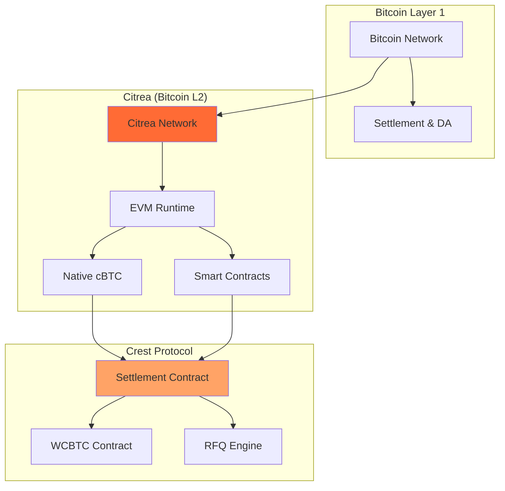
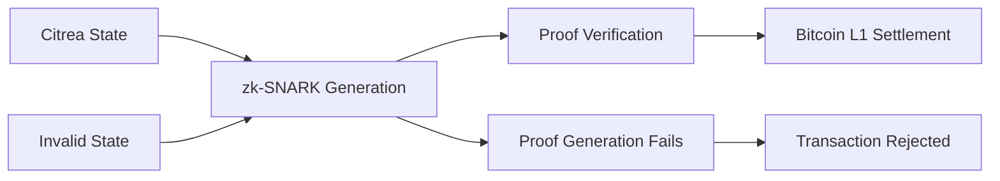

# Citrea Integration

Crest is built on [Citrea](https://citrea.xyz), the first Bitcoin zk-rollup that brings EVM compatibility to Bitcoin. This integration enables Crest to offer true native Bitcoin trading while leveraging the rich ecosystem of Ethereum-compatible tools and protocols.

## Why Citrea?

<CardGroup cols={2}>
  <Card title="Native Bitcoin Support" icon="bitcoin">
    Direct access to Bitcoin's native token (cBTC) without wrapped representations or bridges
  </Card>
  <Card title="EVM Compatibility" icon="code">
    Full Ethereum Virtual Machine compatibility enables familiar development patterns
  </Card>
  <Card title="Bitcoin Security" icon="shield">
    Inherits Bitcoin's security through zk-proof verification on the base layer
  </Card>
  <Card title="High Performance" icon="bolt">
    Low latency and high throughput compared to Bitcoin's base layer
  </Card>
</CardGroup>

## Citrea Architecture Overview



## Native cBTC Benefits

### What is cBTC?

cBTC (Citrea Bitcoin) is the native representation of Bitcoin on Citrea. Unlike wrapped Bitcoin on other chains, cBTC maintains a 1:1 peg with Bitcoin through cryptographic proofs rather than custodial bridges.

```solidity
// Native cBTC can be used directly in smart contracts
function receiveNativeBitcoin() external payable {
    // msg.value contains native cBTC amount
    require(msg.value > 0, "Must send cBTC");

    // Process native Bitcoin directly
    processPayment(msg.sender, msg.value);
}
```

### Key Advantages

<Tabs>
  <Tab title="No Custodial Risk">
    **Traditional Wrapped Bitcoin**:
    - Requires trusted custodians
    - Bridge security risks
    - Potential for depegging

    **Citrea cBTC**:
    - Cryptographically secured
    - No custodial intermediaries
    - Maintains exact Bitcoin parity
  </Tab>

  <Tab title="Gas Efficiency">
    **Traditional Approach**:
    ```solidity
    // Multiple transactions required
    wbtc.approve(protocol, amount);
    protocol.deposit(amount);
    protocol.trade(params);
    ```

    **Citrea Native**:
    ```solidity
    // Single transaction with native value
    protocol.trade{value: amount}(params);
    ```
  </Tab>

  <Tab title="User Experience">
    - No pre-wrapping required
    - Direct Bitcoin wallet integration
    - Familiar Bitcoin UX patterns
    - Reduced transaction complexity
  </Tab>
</Tabs>

## Technical Integration

### Network Configuration

```typescript
// Citrea network configuration
const citreaConfig = {
  chainId: 5115, // Citrea testnet
  name: 'Citrea Testnet',
  rpcUrls: ['https://rpc.testnet.citrea.xyz'],
  nativeCurrency: {
    name: 'cBTC',
    symbol: 'cBTC',
    decimals: 18
  },
  blockExplorerUrls: ['https://explorer.testnet.citrea.xyz']
};

// Add to MetaMask
await window.ethereum.request({
  method: 'wallet_addEthereumChain',
  params: [citreaConfig],
});
```

### Smart Contract Deployment

Deploying to Citrea uses standard Ethereum tooling:

```typescript
// hardhat.config.ts
const config: HardhatUserConfig = {
  networks: {
    citrea: {
      url: "https://rpc.testnet.citrea.xyz",
      accounts: [process.env.PRIVATE_KEY!],
      chainId: 5115,
    }
  },
  solidity: "0.8.20"
};
```

```bash
# Deploy contracts to Citrea
npx hardhat run scripts/deploy.ts --network citrea

# Verify contracts
npx hardhat verify --network citrea <CONTRACT_ADDRESS> [CONSTRUCTOR_ARGS]
```

## Crest's Citrea Integration

### Native Bitcoin Handling

Crest leverages Citrea's native cBTC support in multiple ways:

#### 1. Direct Trading Support

```solidity
// Users can trade native cBTC directly
function settleRFQT(QuoteParams calldata params, bytes calldata signature)
    external payable nonReentrant {

    if (params.tokenIn == NATIVE_TOKEN) {
        // Handle native cBTC input
        require(msg.value == params.amountIn, "Incorrect cBTC amount");

        // Wrap for market maker compatibility
        wcbtc.deposit{value: params.amountIn}();
        IERC20(address(wcbtc)).safeTransfer(params.marketMaker, params.amountIn);
    }

    if (params.tokenOut == NATIVE_TOKEN) {
        // Handle native cBTC output
        IERC20(address(wcbtc)).safeTransferFrom(
            params.marketMaker,
            address(this),
            params.amountOut
        );

        // Unwrap and send native cBTC to user
        wcbtc.withdraw(params.amountOut);
        payable(params.user).transfer(userReceiveAmount);
    }
}
```

#### 2. WCBTC Bridge Contract

The WCBTC contract seamlessly bridges native cBTC and ERC20 representations:

```solidity
contract WCBTC is ERC20 {
    // Wrap native cBTC into ERC20 WCBTC
    function deposit() public payable {
        _mint(msg.sender, msg.value);
        emit Deposit(msg.sender, msg.value);
    }

    // Unwrap WCBTC back to native cBTC
    function withdraw(uint256 wad) public {
        require(balanceOf(msg.sender) >= wad, "Insufficient WCBTC balance");
        _burn(msg.sender, wad);
        payable(msg.sender).transfer(wad);
        emit Withdrawal(msg.sender, wad);
    }

    // Automatic wrapping when receiving cBTC
    receive() external payable {
        deposit();
    }
}
```

### Performance Benefits

#### Transaction Speed
- **Bitcoin L1**: ~10 minutes per block
- **Citrea**: ~2-3 seconds per block
- **Crest Settlement**: Near-instant execution

#### Transaction Costs
```typescript
// Approximate gas costs on Citrea
const gasCosts = {
  settleRFQT: '~150,000 gas',
  wcbtcDeposit: '~50,000 gas',
  wcbtcWithdraw: '~35,000 gas',
  erc20Transfer: '~21,000 gas'
};

// With current Citrea gas prices (~1 gwei)
const costInCBTC = {
  settleRFQT: '~0.00015 cBTC', // ~$0.10 at $50k BTC
  wcbtcDeposit: '~0.00005 cBTC',
  wcbtcWithdraw: '~0.000035 cBTC'
};
```

## Development Experience

### Familiar Tooling

Since Citrea is EVM-compatible, all Ethereum development tools work seamlessly:

<Tabs>
  <Tab title="Hardhat">
    ```typescript
    // Standard Hardhat setup works with Citrea
    import { ethers } from "hardhat";

    const Settlement = await ethers.getContractFactory("Settlement");
    const settlement = await Settlement.deploy(wcbtcAddress);
    await settlement.deployed();
    ```
  </Tab>

  <Tab title="Ethers.js">
    ```typescript
    // Standard ethers.js interactions
    const provider = new ethers.providers.JsonRpcProvider(
      'https://rpc.testnet.citrea.xyz'
    );

    const contract = new ethers.Contract(
      SETTLEMENT_ADDRESS,
      SETTLEMENT_ABI,
      provider
    );
    ```
  </Tab>

  <Tab title="Web3 Libraries">
    ```typescript
    // Works with any Web3 library
    import Web3 from 'web3';

    const web3 = new Web3('https://rpc.testnet.citrea.xyz');
    const contract = new web3.eth.Contract(ABI, ADDRESS);
    ```
  </Tab>
</Tabs>

### Debugging and Monitoring

```typescript
// Standard Ethereum monitoring tools work
const filter = settlementContract.filters.RFQSettled();

settlementContract.on(filter, (
  quoteId,
  user,
  marketMaker,
  tokenIn,
  tokenOut,
  amountIn,
  amountOut,
  isRFQT,
  event
) => {
  console.log('Trade settled:', {
    quoteId,
    user,
    amountIn: ethers.utils.formatEther(amountIn),
    amountOut: ethers.utils.formatEther(amountOut),
    txHash: event.transactionHash
  });
});
```

## Security Model

### zk-Proof Verification

Citrea uses zero-knowledge proofs to ensure state transitions are valid:



### Bitcoin Finality

- **Immediate**: Transactions appear in Citrea blocks (~2-3 seconds)
- **Soft Finality**: zk-proof generated and verified (~1-2 minutes)
- **Hard Finality**: Proof settlement on Bitcoin L1 (~10-60 minutes)

For Crest's RFQ system, soft finality provides sufficient security for trading operations.

### Data Availability

Citrea uses Bitcoin for data availability, ensuring:
- **Censorship Resistance**: Data stored on Bitcoin L1
- **Permanence**: Inherits Bitcoin's immutability
- **Verifiability**: Anyone can reconstruct Citrea state from Bitcoin data

## Scalability Characteristics

### Throughput Comparison

| Network | TPS | Block Time | Finality |
|---------|-----|------------|----------|
| Bitcoin L1 | ~7 TPS | ~10 minutes | ~60 minutes |
| Ethereum L1 | ~15 TPS | ~12 seconds | ~15 minutes |
| **Citrea** | **~1000 TPS** | **~2 seconds** | **~1 minute** |

### Cost Comparison

```typescript
// Approximate transaction costs (at $50k BTC, $3k ETH)
const costComparison = {
  bitcoinL1: {
    transfer: '~$5-50', // Depends on mempool congestion
    settlement: 'Not programmable'
  },
  ethereumL1: {
    transfer: '~$1-20',
    settlement: '~$10-100'
  },
  citrea: {
    transfer: '~$0.01-0.10',
    settlement: '~$0.05-0.20'
  }
};
```

## Bitcoin Integration Benefits

### 1. True Bitcoin Composability

```solidity
// Direct Bitcoin integration in smart contracts
function bitcoinNativeFunction() external payable {
    require(msg.value >= 0.01 ether, "Minimum 0.01 cBTC required");

    // Process Bitcoin payment natively
    processBitcoinPayment(msg.sender, msg.value);

    // Interact with other protocols using same Bitcoin
    yieldProtocol.deposit{value: msg.value * 80 / 100}();
}
```

### 2. Unified Liquidity

- Native Bitcoin doesn't fragment liquidity across bridges
- Market makers hold actual Bitcoin, not synthetic representations
- Cross-protocol composability with native Bitcoin

### 3. Reduced Complexity

```typescript
// Traditional multi-chain Bitcoin trading
const traditionalFlow = [
  'Bridge Bitcoin to chain',
  'Wrap Bitcoin to token',
  'Approve token spending',
  'Execute trade',
  'Unwrap token to Bitcoin',
  'Bridge Bitcoin back'
];

// Crest on Citrea
const crestFlow = [
  'Execute trade with native cBTC'
];
```

## Future Developments

### Planned Citrea Features

<AccordionGroup>
  <Accordion title="Advanced Bitcoin Integration">
    - Native Bitcoin scripting support
    - Lightning Network integration
    - Enhanced privacy features
  </Accordion>

  <Accordion title="Performance Improvements">
    - Higher throughput capabilities
    - Reduced proof generation time
    - Enhanced data compression
  </Accordion>

  <Accordion title="Developer Tools">
    - Bitcoin-specific development frameworks
    - Enhanced debugging tools
    - Better indexing and analytics
  </Accordion>
</AccordionGroup>

### Crest Roadmap

1. **Enhanced Native Integration**
   - Direct Bitcoin wallet integrations
   - Lightning Network support
   - Advanced Bitcoin scripting

2. **Cross-Chain Features**
   - Bitcoin L1 settlement options
   - Other Bitcoin L2 integrations
   - Multi-rollup liquidity sharing

3. **DeFi Ecosystem**
   - Native Bitcoin lending/borrowing
   - Bitcoin-native derivatives
   - Cross-protocol yield strategies

## Development Resources

### Getting Started

```bash
# Set up Citrea development environment
git clone https://github.com/crest-protocol/crest-contracts
cd crest-contracts

# Install dependencies
npm install

# Configure Citrea network
cp .env.example .env
# Add your private key and RPC URL

# Deploy to Citrea testnet
npm run deploy:citrea
```

### Testing Framework

```typescript
// Test with Citrea-specific features
describe("Citrea Integration", function() {
  it("Should handle native cBTC transfers", async function() {
    const amount = ethers.utils.parseEther("1.0");

    // Send native cBTC with transaction
    const tx = await settlement.settleRFQT(
      quoteParams,
      signature,
      { value: amount }
    );

    // Verify native cBTC was processed correctly
    const receipt = await tx.wait();
    expect(receipt.status).to.equal(1);
  });
});
```

### Useful Resources

<CardGroup cols={2}>
  <Card title="Citrea Documentation" icon="book" href="https://docs.citrea.xyz">
    Official Citrea documentation and guides
  </Card>
  <Card title="Bitcoin Developer Resources" icon="bitcoin" href="https://developer.bitcoin.org">
    Bitcoin development resources and tools
  </Card>
</CardGroup>

## Next Steps

Ready to leverage Citrea's Bitcoin integration?

1. **Explore the Citrea testnet** and understand its capabilities
2. **Deploy test contracts** using familiar Ethereum tooling
3. **Experiment with native cBTC** trading and transfers
4. **Build applications** that leverage true Bitcoin composability

- [Smart Contract Overview](/contracts/overview) - Deploy contracts on Citrea
- [Settlement Contract](/contracts/settlement) - Understand native Bitcoin handling
- [WCBTC Contract](/contracts/wcbtc) - Bridge native and wrapped Bitcoin