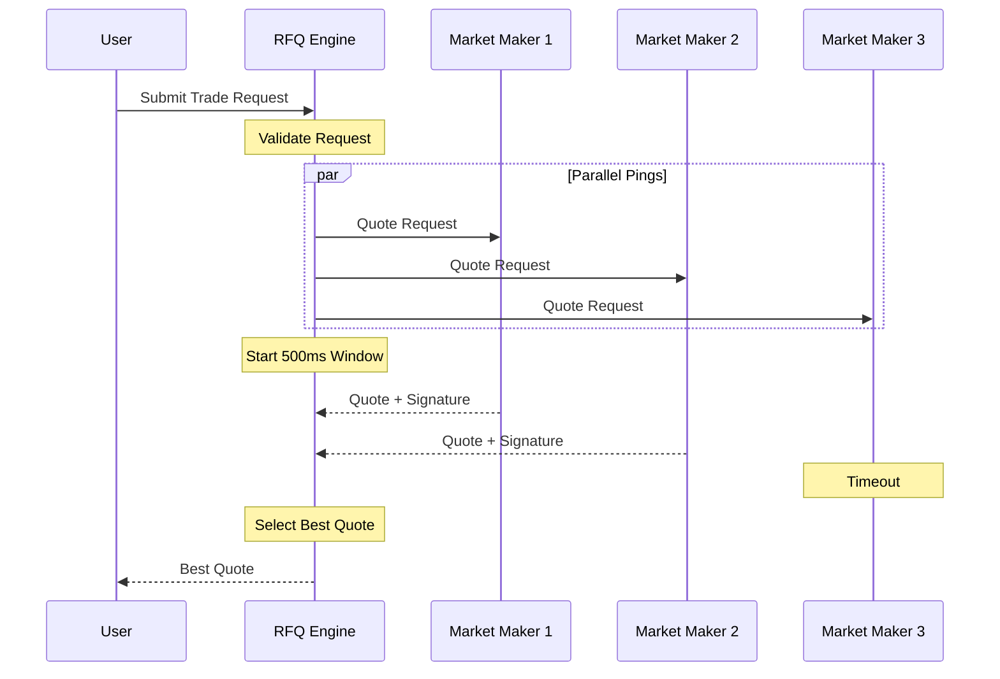

Crest's Request for Quote (RFQ) system is the core of our trading infrastructure, designed to provide competitive pricing through market maker competition while maintaining the speed and efficiency required for seamless trading.

## How RFQ Works

The RFQ system follows a ping-based model. Here's a high-level overview of how it works:

## Quote Request Flow

The RFQ system follows these main steps:

### 1. User Request

The process begins when a user submits a trade request to the RFQ engine. This request includes:
- User's wallet address
- Token in address
- Token out address
- Amount in

### 2. Request Validation

Before processing the request, the RFQ engine validates:
- Trade amount limits and precision
- User authentication and permissions
- Wallet address validity

### 3. Market Maker Pinging

Once validated, the RFQ engine:
- Simultaneously pings all selected market makers via WebSocket
- Includes trade details in the quote request
- Starts a 500ms response window

### 4. Quote Collection

During the 500ms window:
- Market makers respond with signed quotes
- Each quote includes price and execution details
- Quotes are validated in real-time as they arrive
- Late responses (after 500ms) are logged but not considered

### 5. Best Quote Selection

The RFQ engine selects the best quote based on:

1. **Price Competitiveness** (70%)
   - Best execution price for the user

2. **Market Maker Reliability** (20%)
   - Historical fill success rate
   - Quote consistency
   - Settlement reliability

3. **Response Performance** (10%)
   - Quote response time
   - Connection stability
   - System reliability

### 6. Quote Return

Finally:
- The best quote is selected and returned to the user
- The quote includes all necessary execution details
- The user can proceed with trade execution
