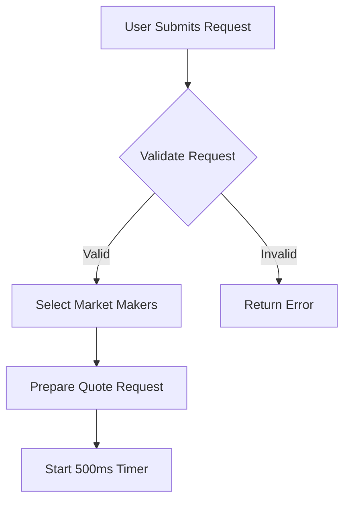
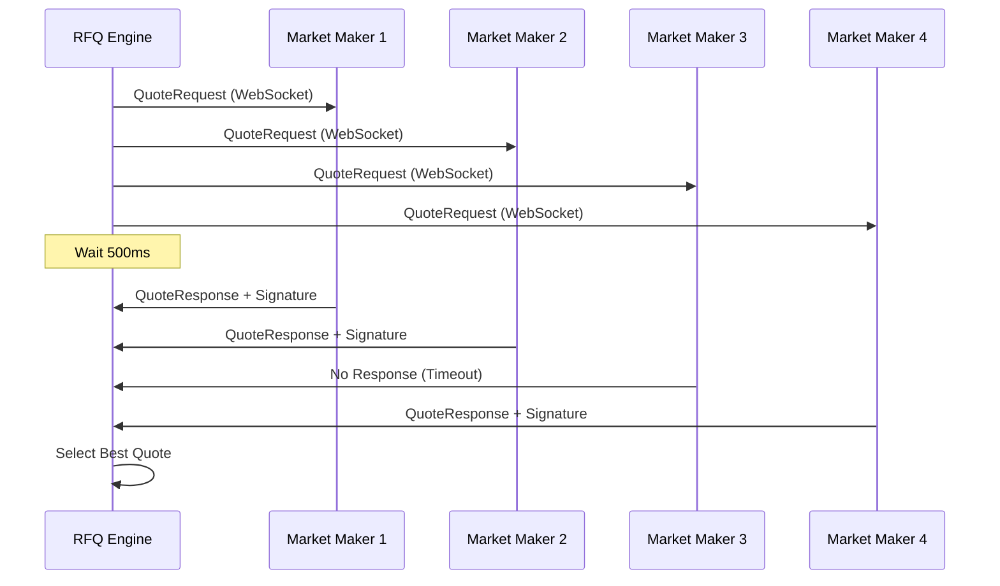
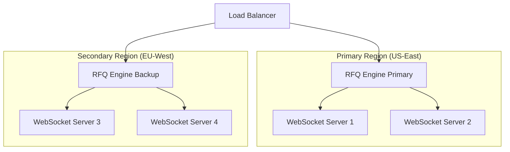

# RFQ System Architecture

Crest's Request for Quote (RFQ) system is the core of our trading infrastructure, designed to provide competitive pricing through market maker competition while maintaining the speed and efficiency required for modern trading.

## What Makes Crest's RFQ Unique

Unlike traditional RFQ systems that rely on streaming quotes, Crest implements a **ping-based RFQ system** similar to Hashflow and 0x, but with several key innovations:

<CardGroup cols={2}>
  <Card title="Ping-Based Requests" icon="radar">
    Instead of streaming continuous quotes, MMs respond to specific requests in real-time
  </Card>
  <Card title="500ms Response Window" icon="clock">
    Tight timing constraints ensure fresh quotes and prevent latency arbitrage
  </Card>
  <Card title="Parallel Pinging" icon="share">
    Simultaneous requests to multiple MMs maximize price competition
  </Card>
  <Card title="WebSocket Infrastructure" icon="wifi">
    Persistent connections enable sub-second quote delivery
  </Card>
</CardGroup>

## System Components

### 1. RFQ Engine

The central orchestrator that manages the entire quote lifecycle:

```typescript
interface RFQEngine {
  // Core functionality
  requestQuote(params: QuoteRequest): Promise<Quote[]>;
  selectBestQuote(quotes: Quote[]): Quote;
  validateQuote(quote: Quote): boolean;

  // Market maker management
  connectMarketMaker(mmId: string, websocket: WebSocket): void;
  pingMarketMakers(request: QuoteRequest): Promise<Quote[]>;

  // Performance monitoring
  trackResponseTime(mmId: string, responseTime: number): void;
  getMarketMakerStats(mmId: string): MMStats;
}
```

#### Key Responsibilities:
- **Request validation**: Ensuring quote requests are properly formatted
- **MM selection**: Choosing which market makers to ping based on:
  - Token pair support
  - Historical performance
  - Current availability
  - Liquidity requirements
- **Response aggregation**: Collecting and processing all MM responses
- **Best quote selection**: Algorithm-driven selection of optimal quotes

### 2. WebSocket Server

High-performance WebSocket infrastructure for real-time communication:

```typescript
interface WebSocketServer {
  // Connection management
  onConnect(mmId: string, ws: WebSocket): void;
  onDisconnect(mmId: string): void;
  onMessage(mmId: string, message: any): void;

  // Broadcasting
  broadcastQuoteRequest(request: QuoteRequest, mmIds: string[]): void;
  sendToMarketMaker(mmId: string, message: any): void;

  // Health monitoring
  pingMarketMaker(mmId: string): void;
  checkConnectionHealth(): ConnectionStatus[];
}
```

#### Features:
- **Persistent connections**: Maintaining long-lived connections with market makers
- **Load balancing**: Distributing requests across multiple server instances
- **Failover handling**: Automatic reconnection and backup server routing
- **Message queuing**: Ensuring reliable message delivery

### 3. Market Maker Interface

Standardized interface for market maker integration:

```typescript
interface MarketMakerInterface {
  // Required methods for MMs
  onQuoteRequest(request: QuoteRequest): Promise<QuoteResponse>;
  onConnectionOpen(engine: RFQEngine): void;
  onConnectionClose(): void;

  // Configuration
  getSupportedPairs(): TokenPair[];
  getMaxTradeSize(pair: TokenPair): number;
  getMinTradeSize(pair: TokenPair): number;
}
```

## Quote Request Flow

### Phase 1: Request Initiation



Request validation includes:
- Token address verification
- Amount bounds checking
- User authentication
- Rate limiting enforcement

### Phase 2: Market Maker Selection

The RFQ engine selects market makers based on multiple criteria:

```typescript
interface MMSelectionCriteria {
  tokenPairSupport: boolean;      // Does MM support this token pair?
  availableLiquidity: number;     // MM's available liquidity
  responseTimeHistory: number[];  // Historical response times
  successRate: number;            // % of successful quotes
  connectionStatus: 'connected' | 'disconnected' | 'unstable';
  maxTradeSize: number;          // MM's maximum trade size
}
```

Selection algorithm:
1. **Primary filter**: Token pair support and liquidity requirements
2. **Performance ranking**: Based on historical success rate and response time
3. **Diversification**: Ensure multiple MMs are selected for competition
4. **Load balancing**: Distribute requests evenly across top-performing MMs

### Phase 3: Parallel Pinging



### Phase 4: Response Collection

During the 500ms window, the engine:
- Collects all incoming quote responses
- Validates signatures and parameters
- Tracks response times for performance metrics
- Handles timeout scenarios gracefully

### Phase 5: Quote Selection Algorithm

```typescript
function selectBestQuote(quotes: Quote[]): Quote {
  // Filter valid quotes
  const validQuotes = quotes.filter(quote =>
    validateSignature(quote) &&
    quote.expiry > Date.now() &&
    quote.amountOut > 0
  );

  if (validQuotes.length === 0) return null;

  // Score each quote
  const scoredQuotes = validQuotes.map(quote => ({
    quote,
    score: calculateQuoteScore(quote)
  }));

  // Return highest scoring quote
  return scoredQuotes
    .sort((a, b) => b.score - a.score)[0]
    .quote;
}

function calculateQuoteScore(quote: Quote): number {
  const priceScore = quote.amountOut; // Higher output = better
  const mmReliabilityScore = getMMReliability(quote.marketMaker);
  const responseTimeScore = getResponseTimeScore(quote.responseTime);

  return (priceScore * 0.7) +
         (mmReliabilityScore * 0.2) +
         (responseTimeScore * 0.1);
}
```

## Market Maker Integration

### Connection Setup

Market makers connect to Crest through WebSocket:

```javascript
// Market Maker WebSocket Client
const ws = new WebSocket('wss://rfq.crest.finance/mm');

ws.on('open', () => {
  // Authenticate and register supported pairs
  ws.send(JSON.stringify({
    type: 'auth',
    mmId: 'your-mm-id',
    apiKey: 'your-api-key',
    supportedPairs: [
      { tokenIn: 'cBTC', tokenOut: 'USDC' },
      { tokenIn: 'USDC', tokenOut: 'cBTC' }
    ]
  }));
});

ws.on('message', async (data) => {
  const message = JSON.parse(data);

  if (message.type === 'quote_request') {
    const quote = await generateQuote(message.request);
    ws.send(JSON.stringify({
      type: 'quote_response',
      requestId: message.requestId,
      quote: quote
    }));
  }
});
```

### Quote Generation

Market makers generate quotes with the following structure:

```typescript
interface QuoteResponse {
  user: string;           // User's address
  marketMaker: string;    // MM's address
  tokenIn: string;        // Input token address
  tokenOut: string;       // Output token address
  amountIn: string;       // Input amount (from request)
  amountOut: string;      // Output amount (MM's quote)
  expiry: number;         // Quote expiration timestamp
  quoteId: string;        // Unique quote identifier
  signature: string;      // MM's signature over quote data
  additionalData?: {      // Optional additional data
    gasEstimate: number;
    executionHint: string;
  };
}
```

### Signature Requirements

Market makers must sign quotes using EIP-712:

```typescript
const domain = {
  name: 'Settlement',
  version: '1',
  chainId: 5115, // Citrea testnet
  verifyingContract: SETTLEMENT_CONTRACT_ADDRESS
};

const types = {
  Quote: [
    { name: 'user', type: 'address' },
    { name: 'tokenIn', type: 'address' },
    { name: 'tokenOut', type: 'address' },
    { name: 'amountIn', type: 'uint256' },
    { name: 'amountOut', type: 'uint256' },
    { name: 'expiry', type: 'uint256' },
    { name: 'quoteId', type: 'bytes32' }
  ]
};

const signature = await signer._signTypedData(domain, types, quoteData);
```

## Performance Optimization

### Connection Management

```typescript
class ConnectionManager {
  private connections: Map<string, WebSocket> = new Map();
  private connectionHealth: Map<string, HealthStatus> = new Map();

  // Maintain connection quality
  startHealthChecks() {
    setInterval(() => {
      this.connections.forEach((ws, mmId) => {
        this.pingConnection(mmId, ws);
      });
    }, 30000); // Ping every 30 seconds
  }

  // Handle connection issues
  handleConnectionError(mmId: string, error: Error) {
    this.markConnectionUnhealthy(mmId);
    this.attemptReconnection(mmId);
  }
}
```

### Response Time Tracking

```typescript
interface ResponseTimeMetrics {
  mmId: string;
  averageResponseTime: number;
  medianResponseTime: number;
  percentile95: number;
  successRate: number;
  totalRequests: number;
}

class PerformanceTracker {
  trackResponse(mmId: string, responseTime: number, success: boolean) {
    // Update metrics
    const metrics = this.getMetrics(mmId);
    metrics.addDataPoint(responseTime, success);

    // Adjust MM selection probability
    this.updateMMWeight(mmId, metrics);
  }
}
```

## Failover and Redundancy

### Multi-Region Deployment



### Graceful Degradation

When market makers are unavailable:
1. **Automatic fallback**: Route to backup MMs
2. **Partial fulfillment**: Execute with available MMs
3. **User notification**: Inform users of limited liquidity
4. **Retry mechanism**: Attempt to reconnect failed MMs

## Monitoring and Analytics

### Real-time Metrics

- **Quote request volume**: Requests per second/minute/hour
- **MM response rates**: Success rate per market maker
- **Average response times**: Latency tracking
- **Settlement success rates**: On-chain execution success
- **Error rates**: Failed quotes, timeouts, signature failures

### Dashboard Metrics

```typescript
interface RFQMetrics {
  totalQuoteRequests: number;
  successfulQuotes: number;
  averageResponseTime: number;
  activeMarketMakers: number;
  topPerformingMMs: MarketMaker[];
  recentErrors: Error[];
}
```

## Security Considerations

### Rate Limiting
- **Per-user limits**: Prevent spam requests
- **Per-MM limits**: Protect market makers from overload
- **Global limits**: System-wide protection

### Request Validation
- **Parameter bounds**: Ensure reasonable trade sizes
- **Token verification**: Validate token contracts
- **User authentication**: Prevent unauthorized access

### Signature Security
- **Replay protection**: Unique quote IDs
- **Expiry enforcement**: Time-bounded quotes
- **Nonce management**: Prevent signature reuse

## Next Steps

Explore related documentation:
- [Smart Contracts](/contracts/overview) - Settlement layer implementation
- [Market Maker Integration](/integration/market-makers) - How to become a market maker
- [WebSocket API](/api/websocket) - Technical WebSocket specification