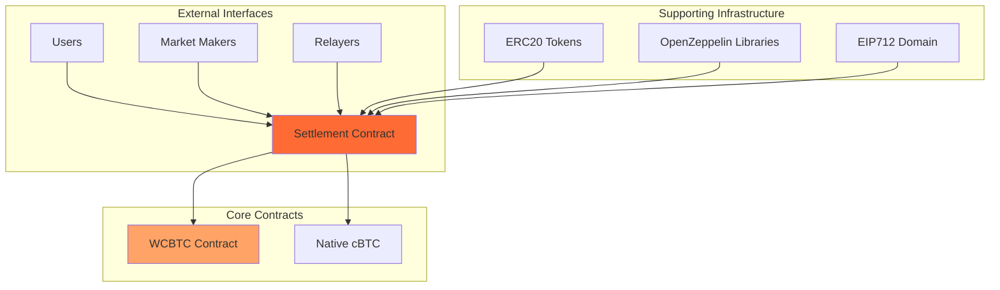
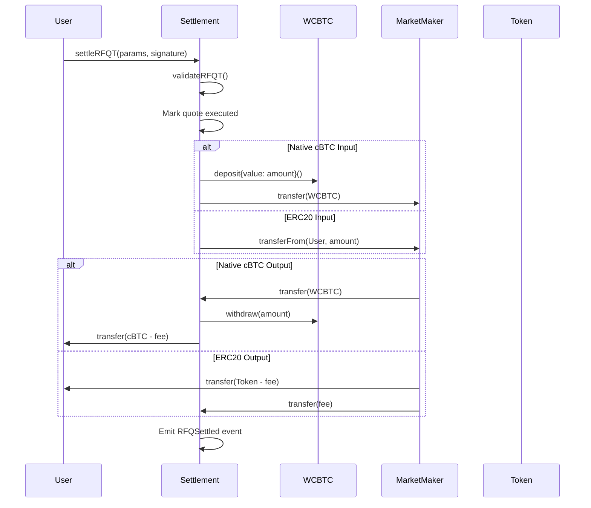

# Smart Contract Architecture

Crest's smart contract architecture is designed for **security, efficiency, and composability**. Built on Citrea's EVM-compatible Bitcoin L2, the contracts enable trustless settlement of RFQ trades while maintaining compatibility with the broader Ethereum ecosystem.

## Architecture Overview



## Design Principles

### 1. Non-Custodial by Design

The Settlement contract never holds funds permanently - all transfers are atomic:

```solidity
// Example: User funds go directly to market maker
IERC20(params.tokenIn).safeTransferFrom(
    params.user,        // From user
    params.marketMaker, // Directly to market maker
    params.amountIn     // No intermediate custody
);
```

### 2. Fail-Safe Mechanisms

Every operation includes comprehensive validation:

<Tabs>
  <Tab title="Input Validation">
    ```solidity
    require(params.user == msg.sender, "Sender must be the user");
    require(block.timestamp <= params.expiry, "Quote expired");
    require(!executedQuotes[params.quoteId], "Quote already executed");
    ```
  </Tab>
  <Tab title="Amount Validation">
    ```solidity
    require(params.amountIn > 0, "Invalid input amount");
    require(params.amountOut > 0, "Invalid output amount");
    require(msg.value == params.amountIn, "Incorrect cBTC amount");
    ```
  </Tab>
  <Tab title="Address Validation">
    ```solidity
    require(params.marketMaker != address(0), "Invalid market maker");
    require(params.tokenIn != params.tokenOut, "Same token trade");
    ```
  </Tab>
</Tabs>

### 3. Gas Optimization

Multiple optimization strategies reduce transaction costs:

```solidity
// Packed struct for efficient storage
struct QuoteParams {
    address user;           // 20 bytes
    address marketMaker;    // 20 bytes
    address tokenIn;        // 20 bytes
    address tokenOut;       // 20 bytes
    uint256 amountIn;       // 32 bytes
    uint256 amountOut;      // 32 bytes
    uint256 expiry;         // 32 bytes
    bytes32 quoteId;        // 32 bytes
} // Total: 208 bytes, efficiently packed

// Single function for multiple signature types
function validateSignature(address signer, bytes32 hash, bytes memory signature)
    public view returns (bool) {
    // Optimized branching logic
    if (signature.length == 65) {
        return signer == hash.recover(signature);
    } else if (signature.length >= 4) {
        // EIP1271 validation
    }
    return false;
}
```

## Contract Hierarchy

### Settlement Contract (Core)

**Purpose**: Primary contract handling all RFQ settlements
**Inheritance**: `EIP712`, `Ownable`, `ReentrancyGuard`

```solidity
contract Settlement is EIP712, Ownable, ReentrancyGuard {
    // Core state variables
    WCBTC public immutable wcbtc;
    uint256 public feeBasisPoints = 30;
    mapping(bytes32 => bool) public executedQuotes;
    mapping(address => uint256) public collectedFees;

    // Core functions
    function settleRFQT(QuoteParams calldata params, bytes calldata signature) external payable;
    function settleRFQM(QuoteParams calldata params, bytes calldata mmSig, bytes calldata userSig) external payable;
    function hashQuote(QuoteParams memory params) public view returns (bytes32);
    function validateSignature(address signer, bytes32 hash, bytes memory signature) public view returns (bool);
}
```

### WCBTC Contract (Supporting)

**Purpose**: Wrapped cBTC for ERC20 compatibility
**Inheritance**: `ERC20`

```solidity
contract WCBTC is ERC20 {
    // Simple wrapping mechanism
    function deposit() public payable;
    function withdraw(uint256 amount) public;
    receive() external payable;
}
```

## State Management

### Critical State Variables

<AccordionGroup>
  <Accordion title="Quote Execution Tracking">
    ```solidity
    // Prevents replay attacks
    mapping(bytes32 => bool) public executedQuotes;

    function _validateQuote(bytes32 quoteId) private {
        require(!executedQuotes[quoteId], "Quote already executed");
        executedQuotes[quoteId] = true; // Mark as executed
    }
    ```
  </Accordion>

  <Accordion title="Fee Collection">
    ```solidity
    // Per-token fee accounting
    mapping(address => uint256) public collectedFees;

    function _collectFee(address token, uint256 amount) private {
        if (amount > 0) {
            collectedFees[token] += amount;
        }
    }
    ```
  </Accordion>

  <Accordion title="Configuration Management">
    ```solidity
    // Configurable parameters with limits
    uint256 public feeBasisPoints = 30; // 0.3%
    uint256 public constant MAX_FEE_BASIS_POINTS = 1000; // 10% cap
    WCBTC public immutable wcbtc; // Set at deployment
    ```
  </Accordion>
</AccordionGroup>

## Security Architecture

### Access Control Patterns

```solidity
// Owner-only functions for protocol management
modifier onlyOwner() {
    require(msg.sender == owner(), "Not authorized");
    _;
}

// User authorization for settlements
modifier onlyAuthorizedUser(address user) {
    require(msg.sender == user, "Not authorized user");
    _;
}

// Market maker authorization through signatures
function _validateMarketMaker(address mm, bytes32 hash, bytes calldata sig) private view {
    require(validateSignature(mm, hash, sig), "Invalid MM signature");
}
```

### Reentrancy Protection

```solidity
// All settlement functions protected
function settleRFQT(...) external payable nonReentrant {
    // State changes before external calls
    executedQuotes[params.quoteId] = true;

    // External calls last
    IERC20(token).safeTransfer(recipient, amount);
}
```

### Integer Overflow Protection

```solidity
// Solidity 0.8+ built-in protection + explicit checks
function _calculateFee(uint256 amountOut)
    private view returns (uint256 feeAmount, uint256 userReceiveAmount) {
    feeAmount = (amountOut * feeBasisPoints) / 10000;
    userReceiveAmount = amountOut - feeAmount; // Safe subtraction

    // Additional validation
    require(userReceiveAmount <= amountOut, "Fee calculation error");
}
```

## Function Flow Patterns

### RFQ-T Settlement Flow



### Error Handling Strategy

```solidity
// Graceful error handling with descriptive messages
function settleRFQT(QuoteParams calldata params, bytes calldata signature)
    external payable nonReentrant {

    try this._validateAndExecuteRFQT(params, signature) {
        // Success path
        emit RFQSettled(params.quoteId, params.user, params.marketMaker, /* ... */, true);
    } catch Error(string memory reason) {
        // Handle known errors
        revert(string.concat("Settlement failed: ", reason));
    } catch {
        // Handle unknown errors
        revert("Settlement failed: Unknown error");
    }
}
```

## Gas Optimization Patterns

### Batch Operations

```solidity
// Future: Batch multiple settlements
function batchSettle(
    QuoteParams[] calldata quotes,
    bytes[] calldata signatures
) external payable nonReentrant {
    require(quotes.length == signatures.length, "Array length mismatch");

    for (uint256 i = 0; i < quotes.length; i++) {
        _executeRFQT(quotes[i], signatures[i]);
    }
}
```

### Storage Optimization

```solidity
// Use events for historical data instead of storage
event RFQSettled(
    bytes32 indexed quoteId,
    address indexed user,
    address indexed marketMaker,
    address tokenIn,
    address tokenOut,
    uint256 amountIn,
    uint256 amountOut,
    bool isRFQT
);

// Only store essential state
mapping(bytes32 => bool) public executedQuotes; // Required for security
mapping(address => uint256) public collectedFees; // Required for fee management
```

## Upgradeability Considerations

### Current Architecture (Non-Upgradeable)

```solidity
// Immutable contracts for security
contract Settlement {
    WCBTC public immutable wcbtc; // Set at deployment

    // No proxy patterns to avoid upgrade risks
    // No delegatecall to avoid storage collision
}
```

### Future Upgradeability Options

<CardGroup cols={2}>
  <Card title="Proxy Patterns" icon="arrows-rotate">
    Potential use of OpenZeppelin's upgradeable contracts for future versions
  </Card>
  <Card title="Modular Design" icon="puzzle-piece">
    Separate modules for different functionalities that can be swapped
  </Card>
  <Card title="Version Management" icon="code-branch">
    Deploy new versions alongside old ones with migration paths
  </Card>
  <Card title="Governance Integration" icon="vote">
    Community governance for upgrade decisions and parameter changes
  </Card>
</CardGroup>

## Testing Architecture

### Unit Test Coverage

```solidity
// Example test structure
contract SettlementTest is Test {
    Settlement settlement;
    WCBTC wcbtc;
    MockERC20 usdc;

    function testRFQTNativeTrade() public {
        // Test native cBTC → ERC20 trade
    }

    function testRFQMERC20Trade() public {
        // Test ERC20 → native cBTC trade
    }

    function testFeeCalculation() public {
        // Test fee calculation accuracy
    }

    function testReentrancyProtection() public {
        // Test reentrancy attack prevention
    }
}
```

### Integration Test Patterns

```typescript
// End-to-end settlement testing
describe("Settlement Integration", () => {
  it("should handle complete RFQ-T flow", async () => {
    // 1. Generate quote and signature
    const quote = await generateMarketMakerQuote(params);

    // 2. Execute settlement
    const tx = await settlement.settleRFQT(quote.params, quote.signature, {
      value: quote.params.amountIn
    });

    // 3. Verify settlement
    const receipt = await tx.wait();
    expect(receipt.status).to.equal(1);

    // 4. Check balances and events
    const events = await settlement.queryFilter(settlement.filters.RFQSettled());
    expect(events).to.have.lengthOf(1);
  });
});
```

## Monitoring and Analytics

### Event-Based Monitoring

```solidity
// Comprehensive event emission for monitoring
event RFQSettled(
    bytes32 indexed quoteId,
    address indexed user,
    address indexed marketMaker,
    address tokenIn,
    address tokenOut,
    uint256 amountIn,
    uint256 amountOut,
    bool isRFQT
);

event FeeUpdated(uint256 oldFee, uint256 newFee);
event FeesWithdrawn(address indexed token, address indexed to, uint256 amount);
```

### Analytics Queries

```typescript
// Example monitoring queries
const settlementAnalytics = {
  async getTotalVolume(timeframe: string) {
    const events = await settlement.queryFilter(
      settlement.filters.RFQSettled(),
      getBlockRange(timeframe)
    );

    return events.reduce((total, event) =>
      total.add(event.args.amountOut), BigNumber.from(0)
    );
  },

  async getMarketMakerStats(mm: string) {
    const events = await settlement.queryFilter(
      settlement.filters.RFQSettled(null, null, mm)
    );

    return {
      totalTrades: events.length,
      totalVolume: events.reduce((sum, e) => sum.add(e.args.amountOut), BigNumber.from(0)),
      avgTradeSize: events.length > 0 ? totalVolume.div(events.length) : BigNumber.from(0)
    };
  }
};
```

## Future Architecture Improvements

### Planned Enhancements

<AccordionGroup>
  <Accordion title="Cross-Chain Support">
    - Multi-chain settlement capabilities
    - Bridge integration for cross-chain RFQ
    - Unified liquidity across chains
  </Accordion>

  <Accordion title="Advanced Fee Models">
    - Dynamic fee calculation based on market conditions
    - Volume-based fee discounts
    - Token-specific fee rates
  </Accordion>

  <Accordion title="Governance Integration">
    - Decentralized parameter management
    - Community-driven upgrades
    - Stakeholder voting mechanisms
  </Accordion>

  <Accordion title="MEV Protection">
    - Time-weighted average pricing
    - Commit-reveal schemes
    - Threshold encryption for quotes
  </Accordion>
</AccordionGroup>

## Security Audit Considerations

### Critical Areas for Review

1. **Signature Validation Logic**
   - EIP712 implementation correctness
   - EIP1271 contract signature handling
   - Replay attack prevention

2. **Fund Flow Security**
   - Atomic settlement guarantees
   - Reentrancy protection effectiveness
   - Integer overflow/underflow prevention

3. **Access Control**
   - Owner privilege limitations
   - User authorization mechanisms
   - Market maker verification

4. **Economic Security**
   - Fee calculation accuracy
   - MEV resistance
   - Griefing attack prevention

## Next Steps

Understanding the smart contract architecture:

- [Settlement Contract](/contracts/settlement) - Detailed contract implementation
- [WCBTC Contract](/contracts/wcbtc) - Wrapped Bitcoin mechanics
- [Deployment Guide](/contracts/deployment) - How to deploy and verify contracts