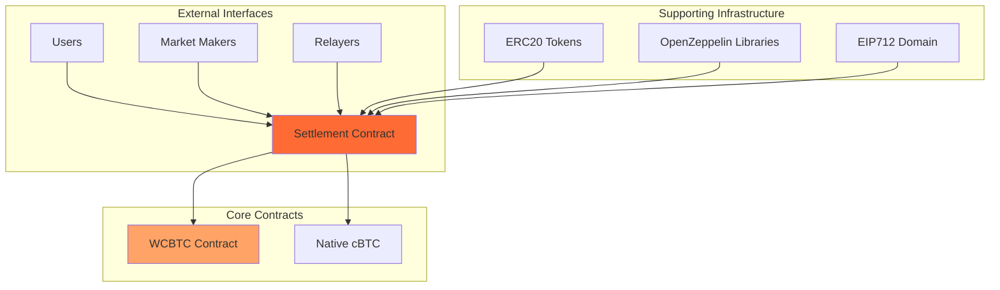
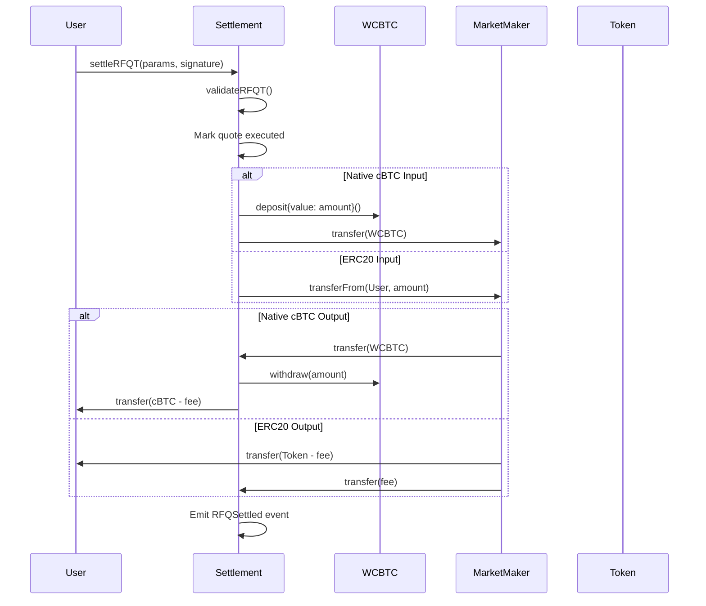

Crest's smart contract architecture is designed for **security, efficiency, and composability**. Built on Citrea's EVM-compatible Bitcoin L2, the contracts enable trustless settlement of RFQ trades.

## Architecture Overview



## Contract Hierarchy

### Settlement Contract (Core)

**Purpose**: Primary contract handling all RFQ settlements
**Inheritance**: `EIP712`, `Ownable`, `ReentrancyGuard`

```solidity
contract Settlement is EIP712, Ownable, ReentrancyGuard {
    // Core state variables
    WCBTC public immutable wcbtc;
    uint256 public feeBasisPoints = 30;
    mapping(bytes32 => bool) public executedQuotes;
    mapping(address => uint256) public collectedFees;

    // Core functions
    function settleRFQT(QuoteParams calldata params, bytes calldata signature) external payable;
    function settleRFQM(QuoteParams calldata params, bytes calldata mmSig, bytes calldata userSig) external payable;
    function hashQuote(QuoteParams memory params) public view returns (bytes32);
    function validateSignature(address signer, bytes32 hash, bytes memory signature) public view returns (bool);
}
```

### WCBTC Contract (Supporting)

**Purpose**: Wrapped cBTC for ERC20 compatibility
**Inheritance**: `ERC20`

```solidity
contract WCBTC is ERC20 {
    // Simple wrapping mechanism
    function deposit() public payable;
    function withdraw(uint256 amount) public;
    receive() external payable;
}
```

## Function Flow Patterns

### RFQ-T Settlement Flow



### Error Handling Strategy

```solidity
// Graceful error handling with descriptive messages
function settleRFQT(QuoteParams calldata params, bytes calldata signature)
    external payable nonReentrant {

    try this._validateAndExecuteRFQT(params, signature) {
        // Success path
        emit RFQSettled(params.quoteId, params.user, params.marketMaker, /* ... */, true);
    } catch Error(string memory reason) {
        // Handle known errors
        revert(string.concat("Settlement failed: ", reason));
    } catch {
        // Handle unknown errors
        revert("Settlement failed: Unknown error");
    }
}
```

## Gas Optimization Patterns

### Batch Operations

```solidity
// Future: Batch multiple settlements
function batchSettle(
    QuoteParams[] calldata quotes,
    bytes[] calldata signatures
) external payable nonReentrant {
    require(quotes.length == signatures.length, "Array length mismatch");

    for (uint256 i = 0; i < quotes.length; i++) {
        _executeRFQT(quotes[i], signatures[i]);
    }
}
```

### Storage Optimization

```solidity
// Use events for historical data instead of storage
event RFQSettled(
    bytes32 indexed quoteId,
    address indexed user,
    address indexed marketMaker,
    address tokenIn,
    address tokenOut,
    uint256 amountIn,
    uint256 amountOut,
    bool isRFQT
);

// Only store essential state
mapping(bytes32 => bool) public executedQuotes; // Required for security
mapping(address => uint256) public collectedFees; // Required for fee management
```

## Next Steps

Understanding the smart contract architecture:

- [Settlement Contract](/contracts/settlement) - Detailed contract implementation
- [WCBTC Contract](/contracts/wcbtc) - Wrapped Bitcoin mechanics
