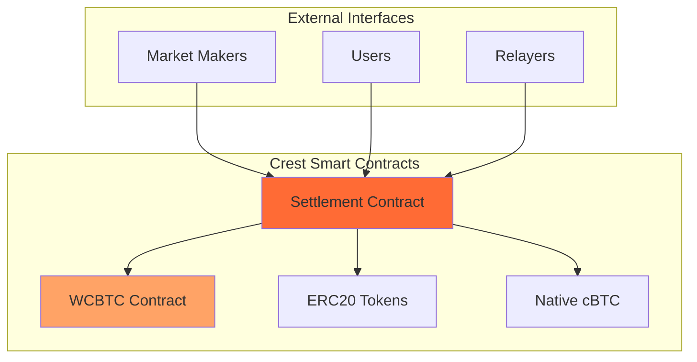
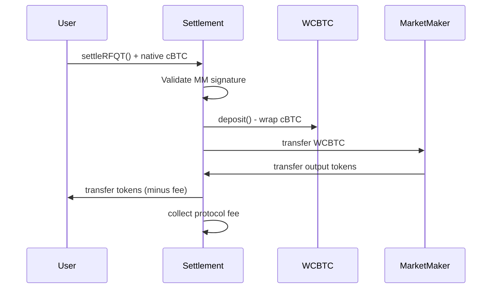
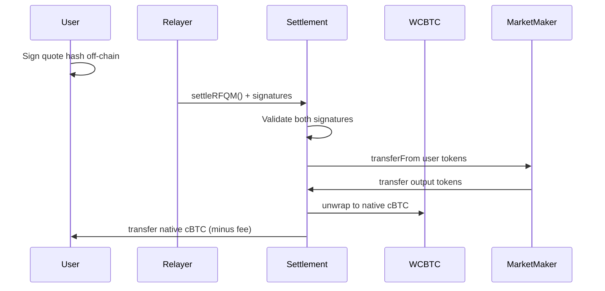

Crest's smart contract architecture is designed for **trustless settlement** of RFQ trades on the Citrea network.

## Contract Architecture



## Core Contracts

<CardGroup cols={2}>
  <Card title="Settlement Contract" icon="handshake">
    **Primary contract** handling all RFQ trade settlements with support for both RFQ-T and RFQ-M execution modes
  </Card>
  <Card title="WCBTC Contract" icon="coins">
    **Wrapped cBTC** contract enabling seamless conversion between native cBTC and ERC20 representation
  </Card>
</CardGroup>

## Design Principles

### 1. Non-Custodial Architecture
```solidity
// Contract never holds user funds permanently
// All transfers are atomic within single transaction
function settleRFQT(QuoteParams calldata params, bytes calldata signature)
    external payable nonReentrant {
    // Direct transfers between user and market maker
    // No intermediate custody required
}
```

### 2. Multi-Signature Support
The contracts support EIP-712 and EIP-1271:

<Tabs>
  <Tab title="EIP-712">
    **Structured data signing** for EOAs
    ```solidity
    hash.recover(signature) == signer
    ```
  </Tab>
  <Tab title="EIP-1271">
    **Smart contract signatures** for contract wallets
    ```solidity
    IERC1271(signer).isValidSignature(hash, signature)
    ```
  </Tab>
</Tabs>

### 3. Native Token Integration
Seamless handling of Citrea's native cBTC:

```solidity
// Native cBTC input handling
if (params.tokenIn == NATIVE_TOKEN) {
    require(msg.value == params.amountIn, "Incorrect cBTC amount");
    wcbtc.deposit{value: params.amountIn}();
    IERC20(address(wcbtc)).safeTransfer(params.marketMaker, params.amountIn);
}

// Native cBTC output handling
if (params.tokenOut == NATIVE_TOKEN) {
    IERC20(address(wcbtc)).safeTransferFrom(params.marketMaker, address(this), params.amountOut);
    wcbtc.withdraw(params.amountOut);
    payable(params.user).transfer(userReceiveAmount);
}
```

## Contract Specifications

### Settlement Contract
- **Address**: 0xe60d30d6e3f36b95b82eebaea32d0db689ac7385
- **Network**: Citrea Testnet
- **Compiler**: Solidity ^0.8.20

#### Key Functions
```solidity
interface ISettlement {
    // RFQ-T: User-initiated settlement
    function settleRFQT(
        QuoteParams calldata params,
        bytes calldata marketMakerSignature
    ) external payable;

    // RFQ-M: Relayer-initiated settlement
    function settleRFQM(
        QuoteParams calldata params,
        bytes calldata marketMakerSignature,
        bytes calldata userSignature
    ) external payable;

    // Quote hash generation
    function hashQuote(QuoteParams memory params)
        external view returns (bytes32);

    // Signature validation
    function validateSignature(
        address signer,
        bytes32 hash,
        bytes memory signature
    ) external view returns (bool);
}
```

### WCBTC Contract
- **Standard**: ERC20-compatible wrapped cBTC
- **Symbol**: WCBTC
- **Decimals**: 18 (matching native cBTC)

#### Core Functions
```solidity
interface IWCBTC {
    // Wrap native cBTC into WCBTC
    function deposit() external payable;

    // Unwrap WCBTC back to native cBTC
    function withdraw(uint256 amount) external;

    // Standard ERC20 functions
    function transfer(address to, uint256 amount) external returns (bool);
    function approve(address spender, uint256 amount) external returns (bool);
    function balanceOf(address account) external view returns (uint256);
}
```

## Trade Execution Flows

### RFQ-T (Trader-Initiated)



### RFQ-M (Meta/Relayer-Initiated)



## Events

### Settlement Event
```solidity
event RFQSettled(
    bytes32 indexed quoteId,
    address indexed user,
    address indexed marketMaker,
    address tokenIn,
    address tokenOut,
    uint256 amountIn,
    uint256 amountOut,
    bool isRFQT
);
```

### Fee Events
```solidity
event FeeUpdated(uint256 oldFee, uint256 newFee);
event FeesWithdrawn(address indexed token, address indexed to, uint256 amount);
```
