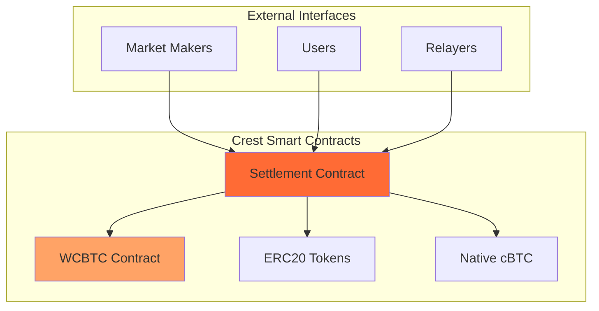
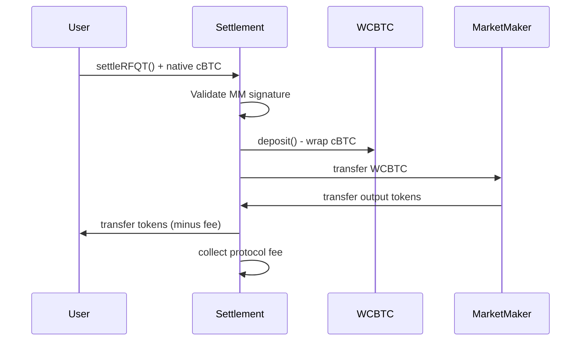
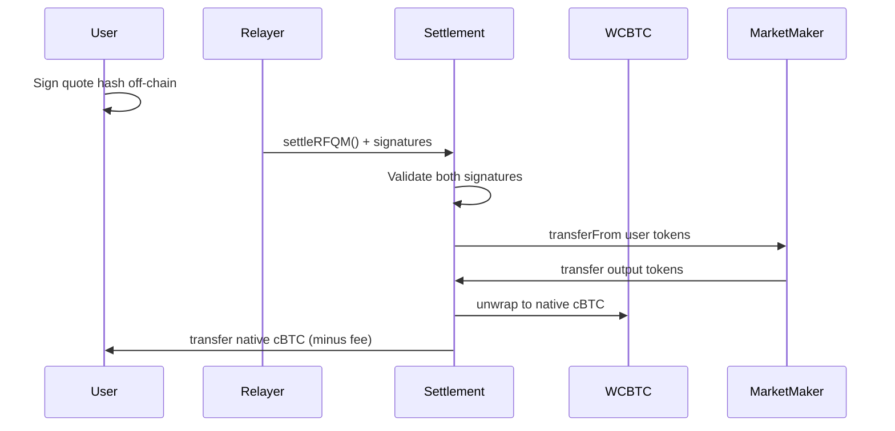

# Smart Contract Overview

Crest's smart contract architecture is designed for **trustless settlement** of RFQ trades on the Citrea network. The system prioritizes security, gas efficiency, and seamless integration with both native cBTC and ERC20 tokens.

## Contract Architecture



## Core Contracts

<CardGroup cols={2}>
  <Card title="Settlement Contract" icon="handshake">
    **Primary contract** handling all RFQ trade settlements with support for both RFQ-T and RFQ-M execution modes
  </Card>
  <Card title="WCBTC Contract" icon="coins">
    **Wrapped cBTC** contract enabling seamless conversion between native cBTC and ERC20 representation
  </Card>
</CardGroup>

## Design Principles

### 1. Non-Custodial Architecture
```solidity
// Contract never holds user funds permanently
// All transfers are atomic within single transaction
function settleRFQT(QuoteParams calldata params, bytes calldata signature)
    external payable nonReentrant {
    // Direct transfers between user and market maker
    // No intermediate custody required
}
```

### 2. Multi-Signature Support
The contracts support three signature validation methods:

<Tabs>
  <Tab title="EIP-712">
    **Structured data signing** for EOAs
    ```solidity
    bytes32 hash = _hashTypedDataV4(
        keccak256(abi.encode(QUOTE_TYPEHASH, ...))
    );
    ```
  </Tab>
  <Tab title="EIP-1271">
    **Smart contract signatures** for contract wallets
    ```solidity
    IERC1271(signer).isValidSignature(hash, signature)
    ```
  </Tab>
  <Tab title="ETHSIGN">
    **Legacy signature recovery** for compatibility
    ```solidity
    hash.recover(signature) == signer
    ```
  </Tab>
</Tabs>

### 3. Native Token Integration
Seamless handling of Citrea's native cBTC:

```solidity
// Native cBTC input handling
if (params.tokenIn == NATIVE_TOKEN) {
    require(msg.value == params.amountIn, "Incorrect cBTC amount");
    wcbtc.deposit{value: params.amountIn}();
    IERC20(address(wcbtc)).safeTransfer(params.marketMaker, params.amountIn);
}

// Native cBTC output handling
if (params.tokenOut == NATIVE_TOKEN) {
    IERC20(address(wcbtc)).safeTransferFrom(params.marketMaker, address(this), params.amountOut);
    wcbtc.withdraw(params.amountOut);
    payable(params.user).transfer(userReceiveAmount);
}
```

## Contract Specifications

### Settlement Contract
- **Address**: [To be deployed]
- **Network**: Citrea Testnet/Mainnet
- **Compiler**: Solidity ^0.8.20
- **Size**: ~15KB bytecode
- **Gas Limit**: ~150K per settlement

#### Key Functions
```solidity
interface ISettlement {
    // RFQ-T: User-initiated settlement
    function settleRFQT(
        QuoteParams calldata params,
        bytes calldata marketMakerSignature
    ) external payable;

    // RFQ-M: Relayer-initiated settlement
    function settleRFQM(
        QuoteParams calldata params,
        bytes calldata marketMakerSignature,
        bytes calldata userSignature
    ) external payable;

    // Quote hash generation
    function hashQuote(QuoteParams memory params)
        external view returns (bytes32);

    // Signature validation
    function validateSignature(
        address signer,
        bytes32 hash,
        bytes memory signature
    ) external view returns (bool);
}
```

### WCBTC Contract
- **Standard**: ERC20-compatible wrapped token
- **Symbol**: WCBTC
- **Decimals**: 18 (matching native cBTC)
- **Total Supply**: Unlimited (backed 1:1 by native cBTC)

#### Core Functions
```solidity
interface IWCBTC {
    // Wrap native cBTC into WCBTC
    function deposit() external payable;

    // Unwrap WCBTC back to native cBTC
    function withdraw(uint256 amount) external;

    // Standard ERC20 functions
    function transfer(address to, uint256 amount) external returns (bool);
    function approve(address spender, uint256 amount) external returns (bool);
    function balanceOf(address account) external view returns (uint256);
}
```

## Trade Execution Flows

### RFQ-T (Trader-Initiated)



### RFQ-M (Meta/Relayer-Initiated)



## Security Features

### Reentrancy Protection
```solidity
import "@openzeppelin/contracts/utils/ReentrancyGuard.sol";

contract Settlement is ReentrancyGuard {
    function settleRFQT(...) external payable nonReentrant {
        // Protected against reentrancy attacks
    }
}
```

### Quote Uniqueness
```solidity
mapping(bytes32 => bool) public executedQuotes;

function _validateRFQT(QuoteParams memory params, bytes calldata signature) private {
    require(!executedQuotes[params.quoteId], "Quote already executed");
    // ... other validations
    executedQuotes[params.quoteId] = true;
}
```

### Expiry Enforcement
```solidity
require(block.timestamp <= params.expiry, "Quote expired");
```

### Amount Validation
```solidity
require(params.amountIn > 0 && params.amountOut > 0, "Invalid amounts");
```

## Fee Structure

### Protocol Fees
- **Default Rate**: 0.3% (30 basis points)
- **Maximum Rate**: 10% (1000 basis points)
- **Collection**: Deducted from output amount
- **Management**: Owner-controlled fee updates

```solidity
function _calculateFee(uint256 amountOut)
    private view returns (uint256 feeAmount, uint256 userReceiveAmount) {
    feeAmount = (amountOut * feeBasisPoints) / 10000;
    userReceiveAmount = amountOut - feeAmount;
}
```

### Fee Withdrawal
```solidity
function withdrawFees(address token, address to) external onlyOwner {
    uint256 amount = collectedFees[token];
    require(amount > 0, "No fees to withdraw");

    collectedFees[token] = 0;

    if (token == NATIVE_TOKEN) {
        payable(to).transfer(amount);
    } else {
        IERC20(token).safeTransfer(to, amount);
    }
}
```

## Gas Optimization

### Packed Structs
```solidity
struct QuoteParams {
    address user;           // 20 bytes
    address marketMaker;    // 20 bytes
    address tokenIn;        // 20 bytes
    address tokenOut;       // 20 bytes
    uint256 amountIn;       // 32 bytes
    uint256 amountOut;      // 32 bytes
    uint256 expiry;         // 32 bytes
    bytes32 quoteId;        // 32 bytes
}
```

### Efficient Validation
```solidity
// Single signature validation function for all types
function validateSignature(address signer, bytes32 hash, bytes memory signature)
    public view returns (bool) {

    if (signature.length == 65) {
        // EOA signature - direct recovery
        return signer == hash.recover(signature);
    } else if (signature.length >= 4) {
        // Contract signature - EIP1271
        try IERC1271(signer).isValidSignature(hash, signature)
            returns (bytes4 magicValue) {
            return magicValue == EIP1271_MAGIC_VALUE;
        } catch {
            return false;
        }
    }
    return false;
}
```

## Events and Monitoring

### Settlement Event
```solidity
event RFQSettled(
    bytes32 indexed quoteId,
    address indexed user,
    address indexed marketMaker,
    address tokenIn,
    address tokenOut,
    uint256 amountIn,
    uint256 amountOut,
    bool isRFQT
);
```

### Fee Events
```solidity
event FeeUpdated(uint256 oldFee, uint256 newFee);
event FeesWithdrawn(address indexed token, address indexed to, uint256 amount);
```

## Deployment Configuration

### Constructor Parameters
```solidity
constructor(address _wcbtc) EIP712("Settlement", "1") Ownable(msg.sender) {
    require(_wcbtc != address(0), "Invalid WCBTC address");
    wcbtc = WCBTC(payable(_wcbtc));
}
```

### Network Compatibility
- **Citrea Testnet**: Chain ID 5115
- **Citrea Mainnet**: Chain ID [TBD]
- **Local Development**: Chain ID 31337

## Testing and Verification

### Test Coverage
- **Unit Tests**: 100% function coverage
- **Integration Tests**: End-to-end settlement flows
- **Fuzz Testing**: Edge case validation
- **Gas Optimization**: Benchmark comparisons

### Formal Verification
- **Signature validation correctness**
- **Fee calculation accuracy**
- **Reentrancy protection**
- **Access control enforcement**

## Next Steps

Explore the detailed contract implementations:
- [Settlement Contract](/contracts/settlement) - Complete function reference
- [WCBTC Contract](/contracts/wcbtc) - Wrapped Bitcoin implementation
- [Deployment Guide](/contracts/deployment) - How to deploy contracts