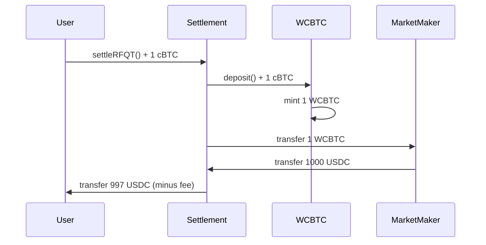
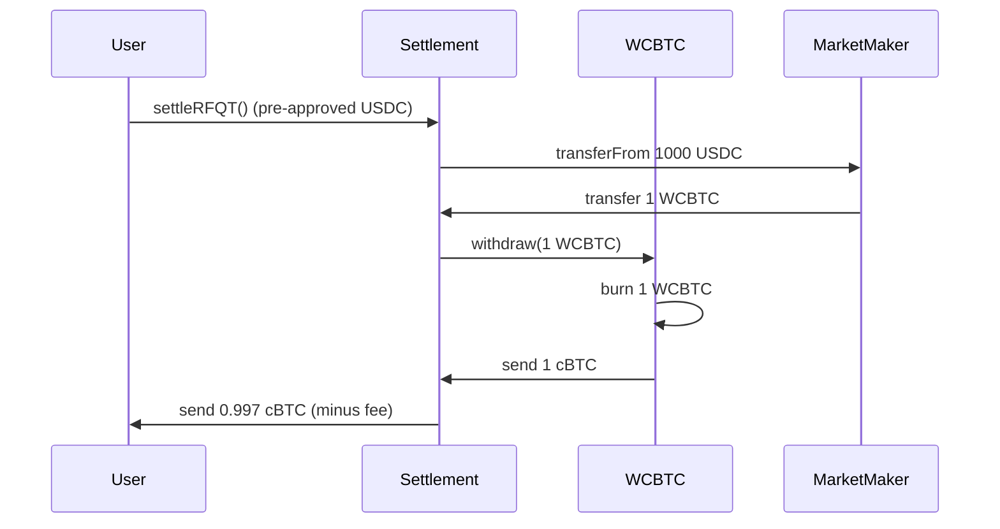

The WCBTC (Wrapped cBTC) contract is a crucial component of Crest's architecture, enabling seamless conversion between Citrea's native cBTC and an ERC20-compatible representation. This allows for efficient DeFi integration while maintaining 1:1 backing with Bitcoin.

## Contract Overview

```solidity
contract WCBTC is ERC20 {
    constructor() ERC20("Wrapped cBTC", "WCBTC") {}

    // Events
    event Deposit(address indexed dst, uint256 wad);
    event Withdrawal(address indexed src, uint256 wad);
}
```

## Why WCBTC?

<CardGroup cols={2}>
  <Card title="Native Token Challenges" icon="triangle-exclamation">
    Native tokens can't be handled by standard ERC20 interfaces, creating integration complexity
  </Card>
  <Card title="DeFi Compatibility" icon="handshake">
    Wrapped tokens enable seamless integration with DeFi protocols and market makers
  </Card>
  <Card title="Gas Efficiency" icon="bolt">
    ERC20 transfers are more gas-efficient than native token handling in complex operations
  </Card>
  <Card title="1:1 Backing" icon="scale-balanced">
    Every WCBTC token is backed by exactly 1 cBTC held in the contract
  </Card>
</CardGroup>

## Core Functions

### Deposit (Wrapping)

**Function Signature:**
```solidity
function deposit() public payable
```

**Implementation:**
```solidity
function deposit() public payable {
    _mint(msg.sender, msg.value);
    emit Deposit(msg.sender, msg.value);
}
```

**Usage:**
```typescript
// Wrap 1 cBTC into WCBTC
const tx = await wcbtcContract.deposit({
  value: ethers.utils.parseEther("1.0") // 1 cBTC
});

// Check WCBTC balance
const wcbtcBalance = await wcbtcContract.balanceOf(userAddress);
console.log(`WCBTC Balance: ${ethers.utils.formatEther(wcbtcBalance)}`);
```

### Withdraw (Unwrapping)

**Function Signature:**
```solidity
function withdraw(uint256 wad) public
```

**Implementation:**
```solidity
function withdraw(uint256 wad) public {
    require(balanceOf(msg.sender) >= wad, "Insufficient WCBTC balance");
    _burn(msg.sender, wad);
    payable(msg.sender).transfer(wad);
    emit Withdrawal(msg.sender, wad);
}
```

**Usage:**
```typescript
// Unwrap 0.5 WCBTC back to native cBTC
const amount = ethers.utils.parseEther("0.5");
const tx = await wcbtcContract.withdraw(amount);

// Check native cBTC balance
const nativeBalance = await provider.getBalance(userAddress);
console.log(`Native cBTC Balance: ${ethers.utils.formatEther(nativeBalance)}`);
```

## Automatic Deposit Functions

### Receive Function

```solidity
receive() external payable {
    deposit();
}
```

The `receive()` function allows users to send cBTC directly to the contract, automatically wrapping it into WCBTC.

**Usage:**
```typescript
// Send cBTC directly to WCBTC contract - automatically wraps
const tx = await signer.sendTransaction({
  to: WCBTC_ADDRESS,
  value: ethers.utils.parseEther("1.0")
});
```

### Fallback Function

```solidity
fallback() external payable {
    deposit();
}
```

The `fallback()` function ensures any transaction with data sent to the contract will still trigger the deposit function.

## Standard ERC20 Interface

WCBTC implements the full ERC20 standard, inherited from OpenZeppelin's ERC20 implementation:

### Token Information
- **Name**: "Wrapped cBTC"
- **Symbol**: "WCBTC"
- **Decimals**: 18 (matching native cBTC precision)
- **Total Supply**: Dynamic (equals total cBTC deposited)

### Core ERC20 Functions

```solidity
// Standard ERC20 functions (inherited)
function transfer(address to, uint256 amount) public returns (bool);
function approve(address spender, uint256 amount) public returns (bool);
function transferFrom(address from, address to, uint256 amount) public returns (bool);
function balanceOf(address account) public view returns (uint256);
function allowance(address owner, address spender) public view returns (uint256);
```

## Integration with Settlement Contract

The Settlement contract uses WCBTC for native token handling:

### Wrapping in Settlement

```solidity
// From Settlement contract _executeRFQT function
if (params.tokenIn == NATIVE_TOKEN) {
    require(msg.value == params.amountIn, "Incorrect cBTC amount");

    // Wrap native cBTC into WCBTC
    wcbtc.deposit{value: params.amountIn}();

    // Transfer WCBTC to market maker
    IERC20(address(wcbtc)).safeTransfer(params.marketMaker, params.amountIn);
}
```

### Unwrapping in Settlement

```solidity
// From Settlement contract _executeRFQT function
if (params.tokenOut == NATIVE_TOKEN) {
    // Market maker sends WCBTC to contract
    IERC20(address(wcbtc)).safeTransferFrom(
        params.marketMaker,
        address(this),
        params.amountOut
    );

    // Unwrap WCBTC to native cBTC
    wcbtc.withdraw(params.amountOut);

    // Send native cBTC to user
    (bool success, ) = payable(params.user).call{value: userReceiveAmount}("");
    require(success, "cBTC transfer to user failed");
}
```

## Trade Flow Examples

### Native cBTC → ERC20 Token (RFQ-T)



### ERC20 Token → Native cBTC (RFQ-T)



## Events

### Deposit Event

```solidity
event Deposit(address indexed dst, uint256 wad);
```

**Event Parameters:**
- `dst`: Address that received the WCBTC tokens
- `wad`: Amount of cBTC deposited/WCBTC minted

### Withdrawal Event

```solidity
event Withdrawal(address indexed src, uint256 wad);
```

**Event Parameters:**
- `src`: Address that burned WCBTC tokens
- `wad`: Amount of WCBTC burned/cBTC withdrawn
