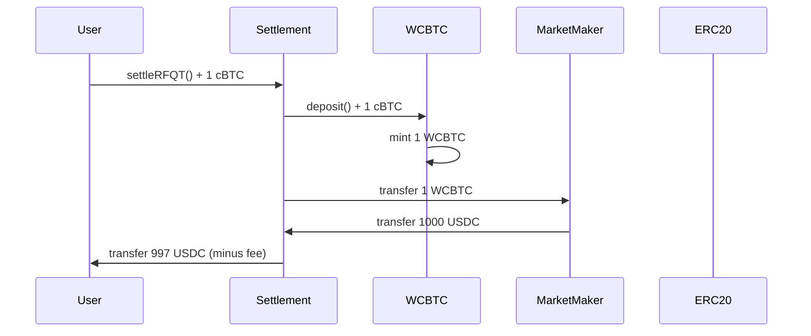
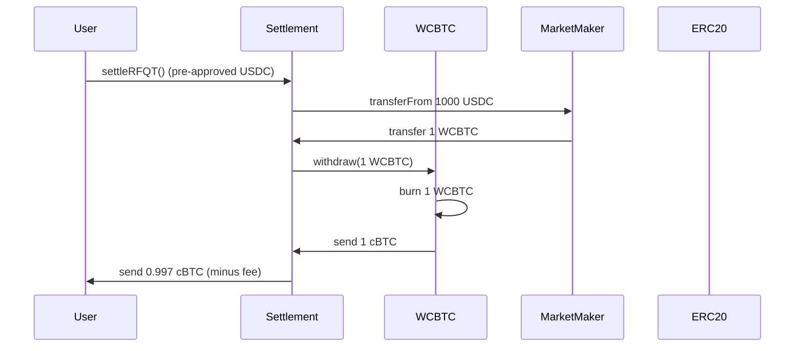

# WCBTC Contract

The WCBTC (Wrapped cBTC) contract is a crucial component of Crest's architecture, enabling seamless conversion between Citrea's native cBTC and an ERC20-compatible representation. This allows for efficient DeFi integration while maintaining 1:1 backing with Bitcoin.

## Contract Overview

```solidity
contract WCBTC is ERC20 {
    constructor() ERC20("Wrapped cBTC", "WCBTC") {}

    // Events
    event Deposit(address indexed dst, uint256 wad);
    event Withdrawal(address indexed src, uint256 wad);
}
```

## Why WCBTC?

<CardGroup cols={2}>
  <Card title="Native Token Challenges" icon="triangle-exclamation">
    Native tokens can't be handled by standard ERC20 interfaces, creating integration complexity
  </Card>
  <Card title="DeFi Compatibility" icon="handshake">
    Wrapped tokens enable seamless integration with DeFi protocols and market makers
  </Card>
  <Card title="Gas Efficiency" icon="bolt">
    ERC20 transfers are more gas-efficient than native token handling in complex operations
  </Card>
  <Card title="1:1 Backing" icon="scale-balanced">
    Every WCBTC token is backed by exactly 1 cBTC held in the contract
  </Card>
</CardGroup>

## Core Functions

### Deposit (Wrapping)

**Function Signature:**
```solidity
function deposit() public payable
```

**Implementation:**
```solidity
function deposit() public payable {
    _mint(msg.sender, msg.value);
    emit Deposit(msg.sender, msg.value);
}
```

**Usage:**
```typescript
// Wrap 1 cBTC into WCBTC
const tx = await wcbtcContract.deposit({
  value: ethers.utils.parseEther("1.0") // 1 cBTC
});

// Check WCBTC balance
const wcbtcBalance = await wcbtcContract.balanceOf(userAddress);
console.log(`WCBTC Balance: ${ethers.utils.formatEther(wcbtcBalance)}`);
```

### Withdraw (Unwrapping)

**Function Signature:**
```solidity
function withdraw(uint256 wad) public
```

**Implementation:**
```solidity
function withdraw(uint256 wad) public {
    require(balanceOf(msg.sender) >= wad, "Insufficient WCBTC balance");
    _burn(msg.sender, wad);
    payable(msg.sender).transfer(wad);
    emit Withdrawal(msg.sender, wad);
}
```

**Usage:**
```typescript
// Unwrap 0.5 WCBTC back to native cBTC
const amount = ethers.utils.parseEther("0.5");
const tx = await wcbtcContract.withdraw(amount);

// Check native cBTC balance
const nativeBalance = await provider.getBalance(userAddress);
console.log(`Native cBTC Balance: ${ethers.utils.formatEther(nativeBalance)}`);
```

## Automatic Deposit Functions

### Receive Function

```solidity
receive() external payable {
    deposit();
}
```

The `receive()` function allows users to send cBTC directly to the contract, automatically wrapping it into WCBTC.

**Usage:**
```typescript
// Send cBTC directly to WCBTC contract - automatically wraps
const tx = await signer.sendTransaction({
  to: WCBTC_ADDRESS,
  value: ethers.utils.parseEther("1.0")
});
```

### Fallback Function

```solidity
fallback() external payable {
    deposit();
}
```

The `fallback()` function ensures any transaction with data sent to the contract will still trigger the deposit function.

## Standard ERC20 Interface

WCBTC implements the full ERC20 standard, inherited from OpenZeppelin's ERC20 implementation:

### Token Information
- **Name**: "Wrapped cBTC"
- **Symbol**: "WCBTC"
- **Decimals**: 18 (matching native cBTC precision)
- **Total Supply**: Dynamic (equals total cBTC deposited)

### Core ERC20 Functions

```solidity
// Standard ERC20 functions (inherited)
function transfer(address to, uint256 amount) public returns (bool);
function approve(address spender, uint256 amount) public returns (bool);
function transferFrom(address from, address to, uint256 amount) public returns (bool);
function balanceOf(address account) public view returns (uint256);
function allowance(address owner, address spender) public view returns (uint256);
```

## Integration with Settlement Contract

The Settlement contract uses WCBTC for native token handling:

### Wrapping in Settlement

```solidity
// From Settlement contract _executeRFQT function
if (params.tokenIn == NATIVE_TOKEN) {
    require(msg.value == params.amountIn, "Incorrect cBTC amount");

    // Wrap native cBTC into WCBTC
    wcbtc.deposit{value: params.amountIn}();

    // Transfer WCBTC to market maker
    IERC20(address(wcbtc)).safeTransfer(params.marketMaker, params.amountIn);
}
```

### Unwrapping in Settlement

```solidity
// From Settlement contract _executeRFQT function
if (params.tokenOut == NATIVE_TOKEN) {
    // Market maker sends WCBTC to contract
    IERC20(address(wcbtc)).safeTransferFrom(
        params.marketMaker,
        address(this),
        params.amountOut
    );

    // Unwrap WCBTC to native cBTC
    wcbtc.withdraw(params.amountOut);

    // Send native cBTC to user
    (bool success, ) = payable(params.user).call{value: userReceiveAmount}("");
    require(success, "cBTC transfer to user failed");
}
```

## Trade Flow Examples

### Native cBTC → ERC20 Token (RFQ-T)



### ERC20 Token → Native cBTC (RFQ-T)



## Events and Monitoring

### Deposit Event

```solidity
event Deposit(address indexed dst, uint256 wad);
```

**Event Parameters:**
- `dst`: Address that received the WCBTC tokens
- `wad`: Amount of cBTC deposited/WCBTC minted

### Withdrawal Event

```solidity
event Withdrawal(address indexed src, uint256 wad);
```

**Event Parameters:**
- `src`: Address that burned WCBTC tokens
- `wad`: Amount of WCBTC burned/cBTC withdrawn

### Event Monitoring Example

```typescript
// Listen for deposit events
wcbtcContract.on("Deposit", (user, amount, event) => {
  console.log(`${user} wrapped ${ethers.utils.formatEther(amount)} cBTC`);
});

// Listen for withdrawal events
wcbtcContract.on("Withdrawal", (user, amount, event) => {
  console.log(`${user} unwrapped ${ethers.utils.formatEther(amount)} WCBTC`);
});
```

## Security Considerations

### 1:1 Backing Guarantee

The contract maintains a perfect 1:1 backing ratio:

```solidity
// Total WCBTC supply always equals contract's cBTC balance
require(address(this).balance == totalSupply(), "Backing ratio violated");
```

### Reentrancy Protection

While WCBTC doesn't explicitly use reentrancy guards, the simple mint/burn mechanism prevents reentrancy attacks:

```solidity
function withdraw(uint256 wad) public {
    // State changes before external call
    require(balanceOf(msg.sender) >= wad, "Insufficient WCBTC balance");
    _burn(msg.sender, wad); // Burns tokens first

    // External call last
    payable(msg.sender).transfer(wad);
}
```

### Integer Overflow Protection

Uses Solidity 0.8.20+ built-in overflow protection and OpenZeppelin's SafeERC20 where applicable.

## Gas Optimization

### Efficient Operations

- **Direct minting**: No intermediate storage or complex calculations
- **Minimal state changes**: Only balance updates required
- **Batch operations**: Can deposit/withdraw multiple times in single transaction

### Gas Costs (Approximate)

| Operation | Gas Cost |
|-----------|----------|
| `deposit()` | ~50,000 gas |
| `withdraw()` | ~35,000 gas |
| `transfer()` | ~21,000 gas |
| `approve()` | ~45,000 gas |

## Market Maker Integration

Market makers should hold WCBTC instead of native cBTC for trading:

```typescript
// Market maker setup
class MarketMaker {
  async setupWCBTC() {
    // Wrap initial cBTC into WCBTC
    const initialDeposit = ethers.utils.parseEther("10.0"); // 10 cBTC
    await this.wcbtcContract.deposit({ value: initialDeposit });

    // Approve Settlement contract to spend WCBTC
    await this.wcbtcContract.approve(
      SETTLEMENT_ADDRESS,
      ethers.constants.MaxUint256
    );
  }

  async provideLiquidity(tokenPair: TokenPair, amount: BigNumber) {
    // Use WCBTC for cBTC pairs
    const tokenAddress = tokenPair.includes('cBTC')
      ? this.wcbtcContract.address
      : tokenPair.address;

    // Ensure sufficient WCBTC balance
    const balance = await this.wcbtcContract.balanceOf(this.address);
    if (balance.lt(amount)) {
      // Wrap more cBTC if needed
      const needed = amount.sub(balance);
      await this.wcbtcContract.deposit({ value: needed });
    }
  }
}
```

## Frontend Integration

### React Hook Example

```typescript
const useWCBTC = (provider: ethers.providers.Provider) => {
  const [wcbtcContract, setWCBTCContract] = useState<ethers.Contract>();
  const [balance, setBalance] = useState<BigNumber>(BigNumber.from(0));

  useEffect(() => {
    const contract = new ethers.Contract(WCBTC_ADDRESS, WCBTC_ABI, provider);
    setWCBTCContract(contract);
  }, [provider]);

  const wrapCBTC = async (amount: BigNumber) => {
    if (!wcbtcContract) return;
    const tx = await wcbtcContract.deposit({ value: amount });
    return tx;
  };

  const unwrapWCBTC = async (amount: BigNumber) => {
    if (!wcbtcContract) return;
    const tx = await wcbtcContract.withdraw(amount);
    return tx;
  };

  const getBalance = async (address: string) => {
    if (!wcbtcContract) return BigNumber.from(0);
    return await wcbtcContract.balanceOf(address);
  };

  return { wrapCBTC, unwrapWCBTC, getBalance, wcbtcContract };
};
```

## Deployment Information

### Constructor Parameters
```solidity
constructor() ERC20("Wrapped cBTC", "WCBTC") {
  // No additional parameters needed
}
```

### Network Addresses
- **Citrea Testnet**: [To be deployed]
- **Citrea Mainnet**: [To be deployed]
- **Local Development**: Deployed via deployment script

### Verification Command
```bash
npx hardhat verify --network citrea <WCBTC_ADDRESS>
```

## Testing and Quality Assurance

### Test Coverage
- ✅ Deposit functionality
- ✅ Withdrawal functionality
- ✅ ERC20 compliance
- ✅ Event emission
- ✅ Edge cases (0 amounts, insufficient balance)
- ✅ Integration with Settlement contract

### Invariant Testing
```solidity
// Invariant: Total supply equals contract balance
assert(address(wcbtc).balance == wcbtc.totalSupply());

// Invariant: Sum of all balances equals total supply
assert(sumOfAllBalances() == wcbtc.totalSupply());
```

## Next Steps

- [Settlement Contract](/contracts/settlement) - How WCBTC integrates with trade settlement
- [Deployment Guide](/contracts/deployment) - Deploy WCBTC and Settlement contracts
- [Market Maker Guide](/integration/market-makers) - Use WCBTC for market making