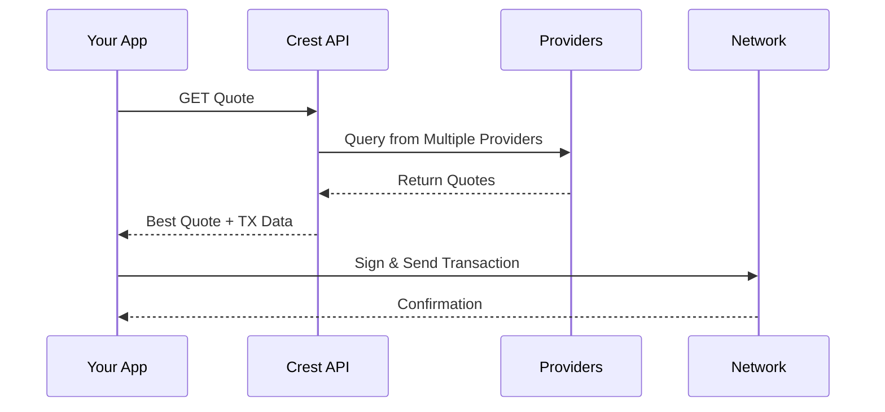

## The Problem

The cryptocurrency ecosystem is fragmented across hundreds of chains, bridges, and liquidity sources. Developers building wallets, trading platforms, or DeFi applications face a critical challenge:

- **Multiple integrations required** - Each swap provider, bridge, or DEX requires separate integration
- **Inconsistent pricing** - No single source offers the best rates across all token pairs
- **Complex routing logic** - Determining optimal paths across chains is resource-intensive
- **Maintenance overhead** - Managing multiple provider APIs, handling failures, and keeping integrations up-to-date

This fragmentation forces developers to either limit their users to suboptimal rates or invest significant engineering resources into building and maintaining complex aggregation infrastructure.

## What is Crest Meta Aggregator API?

Crest's **meta aggregator API** solves liquidity fragmentation by aggregating multiple swap providers and cross-chain bridges into a single, unified interface.

With one API integration, you get access to:

- **Multiple liquidity sources** - We aggregate quotes from leading swap aggregators and bridges
- **Optimal routing** - Our engine automatically finds the best rates and routes for any trade
- **Cross-chain bridging** - Seamlessly move assets across different blockchain networks
- **Unified interface** - One consistent API regardless of underlying providers

## How It Works

The process is simple:

1. **Request a quote** - Your app calls Crest API with swap parameters
2. **Parallel aggregation** - Crest queries multiple providers simultaneously
3. **Best quote returned** - API returns the best quote with transaction data
4. **Execute on-chain** - Your users signs and sends the transaction to the network

With just a few API calls, you can give your users the best possible rates without the complexity.

## Key Benefits

<CardGroup cols={2}>
  <Card title="Best Rates Guaranteed" icon="chart-line">
    Competitive quotes from multiple providers ensure your users always get optimal pricing
  </Card>
  <Card title="Single Integration" icon="plug">
    One API replaces dozens of provider integrations, saving months of development time
  </Card>
  <Card title="Cross-Chain Ready" icon="bridge">
    Seamlessly swap and bridge assets across multiple networks
  </Card>
  <Card title="Always Available" icon="shield-check">
    Smart fallback mechanisms ensure reliability even when individual providers have issues
  </Card>
</CardGroup>

## Use Cases

### Wallets
Integrate Crest to offer your users in-wallet swapping and bridging with the best rates across the entire crypto ecosystem.

### Trading Platforms
Provide professional-grade trading with aggregated liquidity, ensuring competitive pricing for all token pairs.

### DeFi Applications
Enable seamless cross-chain asset movement and swapping within your DeFi application.

### Portfolio Management
Allow users to rebalance portfolios across chains with optimal routing and minimal friction.
