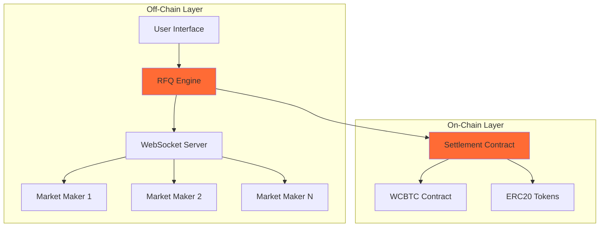
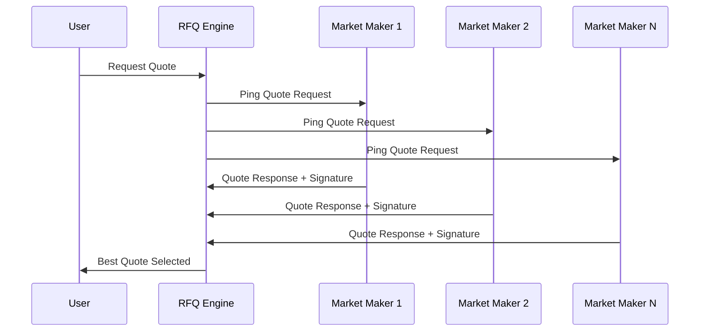

# How Crest Works

Crest's architecture combines **off-chain quote aggregation** with **on-chain settlement**, providing users with the best of both worlds: competitive pricing through market maker competition and trustless execution through smart contracts.

## System Architecture



## Core Components

### 1. RFQ Engine
The heart of Crest's trading system, responsible for:
- **Quote orchestration**: Managing the entire quote lifecycle
- **Market maker selection**: Determining which MMs to ping based on trade parameters
- **Response aggregation**: Collecting and evaluating quotes within the 500ms window
- **Best price discovery**: Algorithm to select optimal quotes considering price, size, and reliability

### 2. WebSocket Infrastructure
Real-time communication layer that enables:
- **Persistent connections** with market makers
- **Sub-second quote requests** and responses
- **Connection health monitoring** and automatic reconnection
- **Load balancing** across multiple market makers

### 3. Smart Contract Settlement
On-chain execution layer providing:
- **Trustless settlements** without custody
- **Multi-signature validation** (EIP712, EIP1271, ETHSIGN)
- **Native Bitcoin support** through WCBTC integration
- **Fee collection** and protocol sustainability

## Quote Lifecycle

### Phase 1: Quote Request
```typescript
interface QuoteRequest {
  tokenIn: string;      // Input token address
  tokenOut: string;     // Output token address
  amountIn: string;     // Input amount
  user: string;         // User's wallet address
  deadline: number;     // Maximum execution time
}
```

When a user requests a quote:
1. **Input validation**: System validates token addresses, amounts, and user permissions
2. **MM selection**: Algorithm selects relevant market makers based on:
   - Token pair support
   - Historical performance
   - Current connectivity status
   - Available liquidity

### Phase 2: Market Maker Ping


Market makers receive:
- **Trade parameters**: Token pair, amount, user address
- **Timing constraints**: 500ms response window
- **Nonce/Quote ID**: Unique identifier for quote tracking

### Phase 3: Quote Response
Market makers respond with:
```solidity
struct QuoteResponse {
    address user;           // User address
    address marketMaker;    // MM address
    address tokenIn;        // Input token
    address tokenOut;       // Output token
    uint256 amountIn;       // Input amount
    uint256 amountOut;      // Output amount (MM's quote)
    uint256 expiry;         // Quote expiration timestamp
    bytes32 quoteId;        // Unique quote identifier
    bytes signature;        // MM's cryptographic signature
}
```

### Phase 4: Quote Selection
The RFQ engine selects the best quote based on:
- **Price competitiveness**: Best exchange rate for the user
- **Market maker reliability**: Historical execution success rate
- **Response time**: Faster responses get slight preference
- **Available liquidity**: Ensuring MM can fulfill the trade

### Phase 5: Settlement Execution

#### RFQ-T (Trader-Initiated)
```solidity
function settleRFQT(
    QuoteParams calldata params,
    bytes calldata marketMakerSignature
) external payable nonReentrant {
    require(params.user == msg.sender, "Sender must be the user");
    _validateRFQT(params, marketMakerSignature);
    _executeRFQT(params);
}
```

#### RFQ-M (Meta/Relayer-Initiated)
```solidity
function settleRFQM(
    QuoteParams calldata params,
    bytes calldata marketMakerSignature,
    bytes calldata userSignature
) external payable nonReentrant {
    require(params.tokenIn != NATIVE_TOKEN, "RFQM does not support native tokenIn");
    _validateRFQM(params, marketMakerSignature, userSignature);
    _executeRFQM(params);
}
```

## Settlement Mechanics

### Native cBTC Handling
When dealing with native cBTC (Citrea's Bitcoin):

1. **Input Processing**:
   - Native cBTC gets wrapped into WCBTC
   - WCBTC transfers to market maker
   - Maintains 1:1 backing with Bitcoin

2. **Output Processing**:
   - Market maker sends WCBTC to contract
   - Contract unwraps WCBTC to native cBTC
   - Native cBTC sent directly to user

### ERC20 Token Handling
For standard ERC20 tokens:
- Direct transfers between parties
- Approval-based system (no custody)
- Standard ERC20 safety checks

### Fee Collection
```solidity
function _calculateFee(uint256 amountOut)
    private view returns (uint256 feeAmount, uint256 userReceiveAmount) {
    feeAmount = (amountOut * feeBasisPoints) / 10000;
    userReceiveAmount = amountOut - feeAmount;
}
```

- **Default fee**: 0.3% (30 basis points)
- **Fee cap**: Maximum 10% (1000 basis points)
- **Collection method**: Deducted from output amount
- **Fee destination**: Protocol treasury

## Security Model

### Signature Validation
Crest supports multiple signature types:

<Tabs>
  <Tab title="EIP712">
    ```solidity
    bytes32 hash = _hashTypedDataV4(
        keccak256(abi.encode(
            QUOTE_TYPEHASH,
            params.user,
            params.tokenIn,
            params.tokenOut,
            params.amountIn,
            params.amountOut,
            params.expiry,
            params.quoteId
        ))
    );
    ```
  </Tab>
  <Tab title="EIP1271">
    ```solidity
    try IERC1271(signer).isValidSignature(hash, signature) returns (
        bytes4 magicValue
    ) {
        return magicValue == EIP1271_MAGIC_VALUE;
    } catch {
        return false;
    }
    ```
  </Tab>
  <Tab title="ETHSIGN">
    ```solidity
    address recoveredSigner = hash.recover(signature);
    return signer == recoveredSigner;
    ```
  </Tab>
</Tabs>

### Protection Mechanisms
- **Reentrancy guards** on all settlement functions
- **Quote uniqueness** prevents double-spending
- **Deadline enforcement** prevents stale quote execution
- **Amount validation** ensures correct token transfers

## Performance Characteristics

<CardGroup cols={2}>
  <Card title="Quote Speed">
    **~500ms** average quote response time
  </Card>
  <Card title="Settlement Speed">
    **~3-5 seconds** on Citrea network
  </Card>
  <Card title="Gas Costs">
    **~150K gas** for typical settlement
  </Card>
  <Card title="Success Rate">
    **>99%** quote execution success rate
  </Card>
</CardGroup>

## Next Steps

Now that you understand how Crest works, explore:
- [User Flow](/introduction/user-flow) - Step-by-step trading process
- [Smart Contracts](/contracts/overview) - Deep dive into contract architecture
- [Integration Guide](/integration/market-makers) - How to integrate with Crest