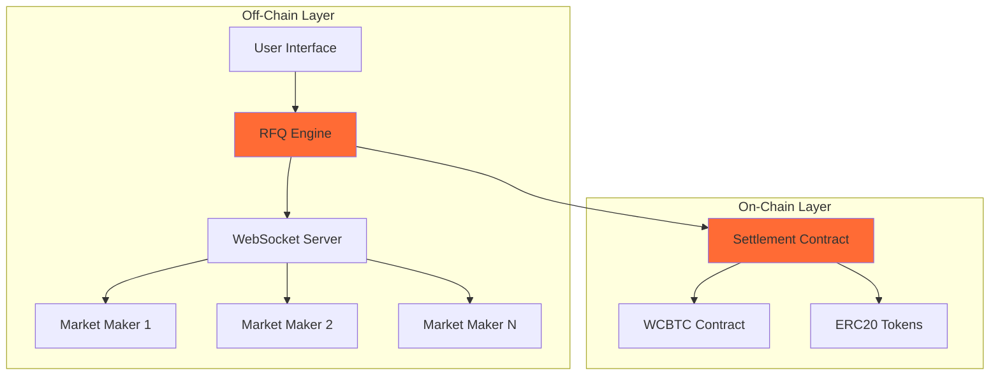
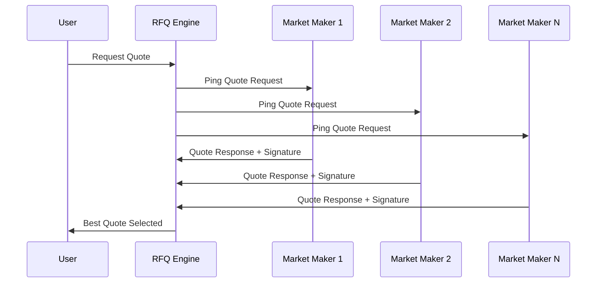

Crest's architecture combines **off-chain quote aggregation** with **on-chain settlement**, providing users with the best of both worlds: competitive pricing through market maker competition and trustless execution through smart contracts.

## System Architecture



## Core Components

### 1. RFQ Engine
The heart of Crest's trading system, responsible for:
- **Quote orchestration**: Managing the entire quote lifecycle
- **Response aggregation**: Collecting and evaluating quotes within the 500ms window
- **Best price discovery**: Algorithm to select optimal quotes considering price, size, and reliability

### 2. WebSocket Infrastructure
Real-time communication layer that enables:
- **Persistent connections** with market makers
- **Sub-second quote requests** and responses
- **Connection health monitoring** and automatic reconnection

### 3. Smart Contract Settlement
On-chain execution layer providing:
- **Trustless settlements** without custody
- **Multi-signature validation** (EIP712, EIP1271, ETHSIGN)
- **Native Bitcoin support** through WCBTC integration

## Quote Lifecycle

### Phase 1: Quote Request
```typescript
interface QuoteRequest {
  tokenIn: string;      // Input token address
  tokenOut: string;     // Output token address
  amountIn: string;     // Input amount
  user: string;         // User's wallet address
}
```

When a user requests a quote, the system validates token addresses, amounts, and user permissions.

### Phase 2: Market Maker Ping


Market makers receive:
- **Trade parameters**: Token pair, amount, user address
- **Timing constraints**: 500ms response window
- **Nonce/Quote ID**: Unique identifier for quote tracking

### Phase 3: Quote Response
Market makers respond with:
```solidity
struct QuoteResponse {
    bytes32 quoteId;        // Unique quote identifier
    address user;           // User address
    address tokenIn;        // Input token
    address tokenOut;       // Output token
    uint256 amountIn;       // Input amount
    uint256 amountOut;      // Output amount (MM's quote)
    uint256 expiry;         // Quote expiration timestamp
    bytes signature;        // MM's cryptographic signature
}
```

### Phase 4: Quote Selection
The RFQ engine selects the best quote based on:
- **Price competitiveness**: Best exchange rate for the user
- **Market maker reliability**: Historical execution success rate
- **Available liquidity**: Ensuring MM can fulfill the trade

### Phase 5: Settlement Execution

#### RFQ-T (Trader-Initiated)
```solidity
function settleRFQT(
    QuoteParams calldata params,
    bytes calldata marketMakerSignature
) external payable nonReentrant {
    require(params.user == msg.sender, "Sender must be the user");
    _validateRFQT(params, marketMakerSignature);
    _executeRFQT(params);
}
```

#### RFQ-M (Meta/Relayer-Initiated)
```solidity
function settleRFQM(
    QuoteParams calldata params,
    bytes calldata marketMakerSignature,
    bytes calldata userSignature
) external payable nonReentrant {
    require(params.tokenIn != NATIVE_TOKEN, "RFQM does not support native tokenIn");
    _validateRFQM(params, marketMakerSignature, userSignature);
    _executeRFQM(params);
}
```

## Settlement Mechanics

### Native cBTC Handling
When dealing with native cBTC (Citrea's Bitcoin):

1. **Input Processing**:
   - Native cBTC gets wrapped into WCBTC
   - WCBTC transfers to market maker
   - Maintains 1:1 backing with Bitcoin

2. **Output Processing**:
   - Contract transfers WCBTC from market maker
   - Contract unwraps WCBTC to native cBTC
   - Native cBTC sent directly to user

### ERC20 Token Handling
For standard ERC20 tokens:
- Direct transfers between parties
- Approval-based system (no custody)
- Standard ERC20 safety checks
