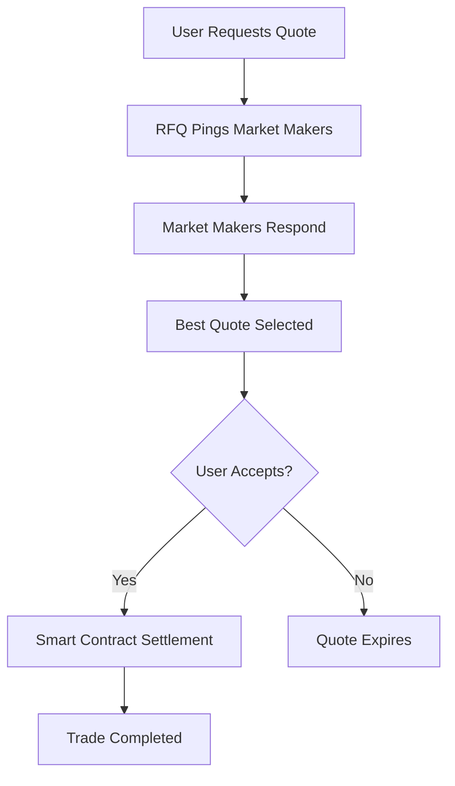

Crest is a **self-custodial Bitcoin trading platform** that brings efficient, secure, and seamless trading to the Bitcoin ecosystem. Built on [Citrea](https://citrea.xyz), an EVM-compatible zk-rollup on Bitcoin, Crest leverages a Request for Quote (RFQ) system to enable seamless Bitcoin trades without requiring users to give up custody of their assets.

## Key Features

<CardGroup cols={2}>
  <Card title="Self-Custodial" icon="shield-halved">
    Your Bitcoin never leaves your control. No custody, no deposits, just secure peer-to-peer trading.
  </Card>
  <Card title="Ping-Based RFQ" icon="satellite-dish">
    Real-time quote requests to market makers via WebSocket connections for optimal pricing.
  </Card>
  <Card title="Native Bitcoin Support" icon="bitcoin">
    Trade native cBTC (Citrea Bitcoin) and ERC20 tokens seamlessly through our smart contracts.
  </Card>
  <Card title="Zero Slippage" icon="bullseye">
    Fixed-price trades with no slippage, thanks to our RFQ mechanism.
  </Card>
</CardGroup>

## Why Crest?

### The Problem
Traditional Bitcoin trading often requires:
- Centralized exchanges with custody risks
- Custodian wrapped Bitcoin solutions
- High fees and slippage
- Limited DeFi integration

### The Solution
Crest solves these problems by:
- **Maintaining self-custody** through smart contract settlements
- **Leveraging Citrea's Bitcoin L2** for native Bitcoin programmability
- **Using RFQ for optimal pricing** without AMM slippage
- **Enabling instant settlements** with cryptographic proofs

## How It Works

1. **Quote Request**: User requests a quote for a token swap
2. **Market Maker Ping**: RFQ system pings connected market makers via WebSocket
3. **Quote Collection**: System waits 500ms to gather competitive quotes
4. **Best Price Selection**: Algorithm selects the most favorable quote
5. **Settlement**: Trade executes onchain with cryptographic verification

## Supported Assets

<AccordionGroup>
  <Accordion title="Native cBTC">
    Citrea's native Bitcoin token, fully backed 1:1 by Bitcoin on the main chain.
  </Accordion>
  <Accordion title="ERC20 Tokens">
    Standard ERC20 tokens deployed on Citrea, including stablecoins and other assets.
  </Accordion>
  <Accordion title="Wrapped cBTC (WCBTC)">
    ERC20 representation of cBTC for seamless DeFi integration.
  </Accordion>
</AccordionGroup>

## Trade Types

Crest supports two distinct trading mechanisms:

### RFQ-T (Request for Quote - Trader)
- **User-initiated** trades
- Supports **native cBTC** as input
- User pays gas fees directly

### RFQ-M (Request for Quote - Meta)
- **Relayer-executed** trades
- **ERC20 tokens only** as input
- Relayer pays gas fees

<Note>
Both trade types support any token as output, including native cBTC, providing maximum flexibility for users.
</Note>

<Card title="Launch Crest App" icon="rocket" href="https://crestapp.xyz">
  Start trading Bitcoin with self-custody and no KYC
</Card>