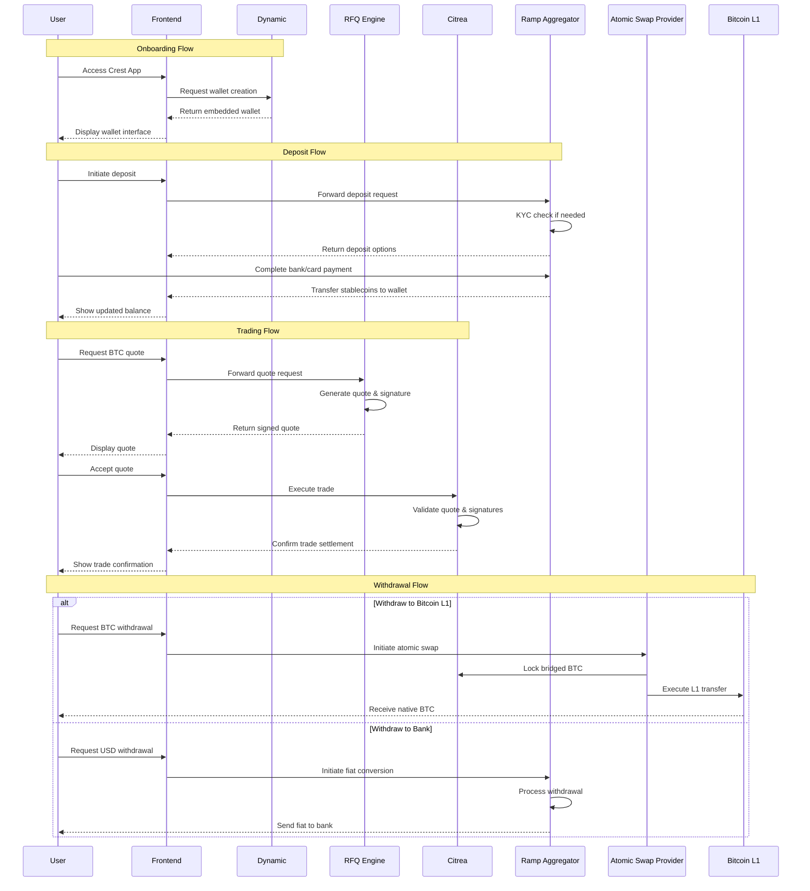

Crest provides a seamless user experience from onboarding through trading and withdrawals. Here's a detailed look at how users interact with the platform and its various components.

## Key Participants

- **User**: Retail trader accessing Crest via mobile or web app
- **Frontend**: Crest app interface that abstracts complexity
- **Dynamic**: Wallet infrastructure for seamless wallet creation and recovery
- **RFQ Engine**: Quote generation and trade execution system
- **Citrea**: L2 blockchain where trades are settled
- **Ramp Aggregator**: Handles fiat deposits and withdrawals
- **Atomic Swap Provider**: Enables trustless swaps between Citrea and Bitcoin L1
- **Bitcoin L1**: The Bitcoin mainchain for final settlement

## Complete Flow Diagram

## Flow Details

### 1. Onboarding
- Users can sign up with social accounts, email, or existing wallet
- Dynamic handles wallet creation and recovery options
- No seed phrases required for basic usage
- Social/email/SMS recovery supported

### 2. Deposits
- Multiple deposit methods supported:
  - Bank transfer
  - Card payment
  - Direct crypto deposit
- KYC requirements vary by method and jurisdiction
- Deposits are converted to stablecoins when needed
- Funds appear in user's wallet after confirmation

### 3. Trading
- User requests quote for desired trade
- RFQ Engine generates competitive quote
- Quote includes signature and expiry time
- User reviews and accepts quote
- Trade settles atomically on Citrea
- No slippage or front-running risks

### 4. Withdrawals
Two withdrawal paths are available:

#### Bitcoin L1 Withdrawal
- Atomic swap initiated between Citrea and Bitcoin L1
- Assets locked on Citrea
- Native BTC transferred on L1
- Trustless process with cryptographic guarantees

#### Fiat Withdrawal
- Convert crypto to fiat via ramp providers
- KYC verification if required
- Direct bank transfer to user's account
- Multiple currency options available

## Security Considerations

- All trades are self-custodial
- Smart contract ensures atomic settlement
- Quotes are cryptographically signed
- Withdrawals use atomic swaps or regulated providers
- User maintains control of assets throughout

<Card title="Try Crest" icon="rocket" href="https://crestapp.xyz">
  Experience seamless Bitcoin trading with complete self-custody
</Card>