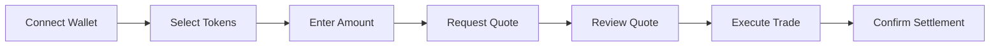
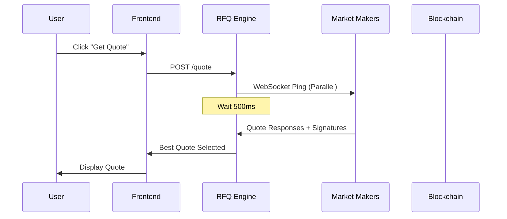
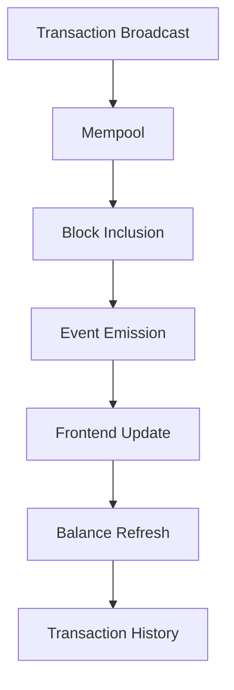

# User Flow

This guide walks through the complete user journey on Crest, from initial quote request to trade settlement. Understanding this flow is essential for developers integrating with Crest and users wanting to maximize their trading experience.

## Overview



## Step-by-Step Process

### 1. Wallet Connection

First, users connect their Citrea-compatible wallet:

<Steps>
  <Step title="Select Wallet">
    Users can connect using:
    - MetaMask (with Citrea network added)
    - WalletConnect-compatible wallets
    - Native Citrea wallets
  </Step>
  <Step title="Network Verification">
    System verifies the wallet is connected to Citrea network
  </Step>
  <Step title="Balance Check">
    Interface displays available balances for all supported tokens
  </Step>
</Steps>

### 2. Trade Configuration

Users configure their desired trade:

```typescript
interface TradeConfig {
  tokenIn: {
    address: string;
    symbol: string;
    decimals: number;
    balance: string;
  };
  tokenOut: {
    address: string;
    symbol: string;
    decimals: number;
  };
  amountIn: string;
  slippageTolerance: number; // Not used in RFQ, but shown for reference
}
```

<CardGroup cols={2}>
  <Card title="Input Token Selection">
    - Native cBTC (for RFQ-T)
    - ERC20 tokens (for both RFQ-T and RFQ-M)
    - Balance validation
    - Allowance checking
  </Card>
  <Card title="Output Token Selection">
    - Any supported token
    - Native cBTC support
    - Price impact estimation
  </Card>
</CardGroup>

### 3. Quote Request Process

When users request a quote, the following happens:



#### Quote Request Payload
```json
{
  "tokenIn": "0x...",
  "tokenOut": "0x...",
  "amountIn": "1000000000000000000",
  "user": "0x...",
  "deadline": 1700000000
}
```

#### Quote Response Format
```json
{
  "quoteId": "0x1234...",
  "marketMaker": "0x...",
  "amountOut": "1950000000",
  "expiry": 1700000300,
  "signature": "0x...",
  "fee": "5850000",
  "executionPrice": "1.945",
  "priceImpact": "0.0%"
}
```

### 4. Quote Review & Approval

Users review the quote details:

<Accordion title="Quote Information Displayed">
  - **Exchange Rate**: Tokens received per token sent
  - **Execution Price**: Final price including fees
  - **Protocol Fee**: 0.3% fee breakdown
  - **Market Maker**: Address of the providing MM
  - **Expiration**: Time remaining to execute
  - **Gas Estimate**: Estimated transaction cost
</Accordion>

### 5. Trade Execution

Based on the trade type, execution follows different paths:

<Tabs>
  <Tab title="RFQ-T Execution">
    **User-Initiated Settlement**

    ```typescript
    // Frontend prepares transaction
    const txData = await settlementContract.populateTransaction.settleRFQT(
      {
        user: userAddress,
        marketMaker: quote.marketMaker,
        tokenIn: quote.tokenIn,
        tokenOut: quote.tokenOut,
        amountIn: quote.amountIn,
        amountOut: quote.amountOut,
        expiry: quote.expiry,
        quoteId: quote.quoteId
      },
      quote.signature,
      {
        value: quote.tokenIn === NATIVE_TOKEN ? quote.amountIn : 0
      }
    );

    // User signs and sends transaction
    const tx = await wallet.sendTransaction(txData);
    ```

    **Process Flow:**
    1. User approves ERC20 tokens (if needed)
    2. User sends transaction with quote parameters
    3. Contract validates market maker signature
    4. Tokens transfer directly between user and MM
    5. Settlement event emitted
  </Tab>

  <Tab title="RFQ-M Execution">
    **Relayer-Initiated Settlement**

    ```typescript
    // User signs the quote hash
    const quoteHash = await settlementContract.hashQuote(
      quote.user,
      quote.tokenIn,
      quote.tokenOut,
      quote.amountIn,
      quote.amountOut,
      quote.expiry,
      quote.quoteId
    );

    const userSignature = await wallet.signMessage(
      ethers.utils.arrayify(quoteHash)
    );

    // Relayer executes the trade
    const tx = await settlementContract.settleRFQM(
      quoteParams,
      quote.marketMakerSignature,
      userSignature
    );
    ```

    **Process Flow:**
    1. User signs quote approval (off-chain)
    2. Relayer submits transaction with both signatures
    3. Contract validates both user and MM signatures
    4. Relayer pays gas fees
    5. Tokens settle according to quote terms
  </Tab>
</Tabs>

### 6. Settlement Confirmation

After successful execution:



Users receive:
- **Transaction Hash**: Link to block explorer
- **Settlement Details**: Final amounts and fees
- **Updated Balances**: Reflected in wallet
- **Trade History**: Stored in local/cloud storage

## Error Handling

Common error scenarios and their handling:

<AccordionGroup>
  <Accordion title="Quote Expiration">
    **Scenario**: User tries to execute an expired quote

    **Handling**:
    - Frontend prevents execution of expired quotes
    - Smart contract reverts with "Quote expired" error
    - User prompted to request new quote
  </Accordion>

  <Accordion title="Insufficient Balance">
    **Scenario**: User lacks sufficient tokens for trade

    **Handling**:
    - Balance validation before quote request
    - Real-time balance updates
    - Clear error messaging
  </Accordion>

  <Accordion title="Market Maker Unavailable">
    **Scenario**: No MMs respond to quote request

    **Handling**:
    - Retry mechanism with exponential backoff
    - Fallback to alternative MMs
    - User notification of temporary unavailability
  </Accordion>

  <Accordion title="Signature Validation Failure">
    **Scenario**: Invalid signature provided

    **Handling**:
    - Client-side signature verification
    - Smart contract validation
    - User prompted to retry signing
  </Accordion>
</AccordionGroup>

## Mobile Considerations

For mobile users, additional considerations include:

<CardGroup cols={2}>
  <Card title="Wallet Integration">
    - WalletConnect for mobile wallets
    - Deep linking for native apps
    - QR code backup for connections
  </Card>
  <Card title="User Experience">
    - Simplified interface for smaller screens
    - Touch-optimized quote selection
    - Offline mode for quote browsing
  </Card>
</CardGroup>

## Advanced Features

### Quote Comparison
Users can compare multiple quotes:
```typescript
interface QuoteComparison {
  quotes: Quote[];
  bestByPrice: Quote;
  bestBySpeed: Quote;
  recommendation: Quote;
  reasons: string[];
}
```

### Partial Fill Handling
For large orders that may not be fully filled:
- Automatic order splitting
- Progressive settlement
- Remainder handling

### Transaction Simulation
Before execution, users can simulate trades:
- Gas estimation
- Outcome prediction
- Error detection

## Integration Points

Key integration points for developers:

1. **Quote API**: RESTful endpoints for quote requests
2. **WebSocket Events**: Real-time quote updates
3. **Contract Interface**: Direct smart contract interaction
4. **Signature Utilities**: Helper functions for signing
5. **Event Monitoring**: Settlement tracking

## Next Steps

Now that you understand the user flow:
- [Explore Smart Contracts](/contracts/overview) - Technical implementation details
- [Integration Guide](/integration/frontend) - Build your own interface
- [Security Best Practices](/security/best-practices) - Ensure safe integration