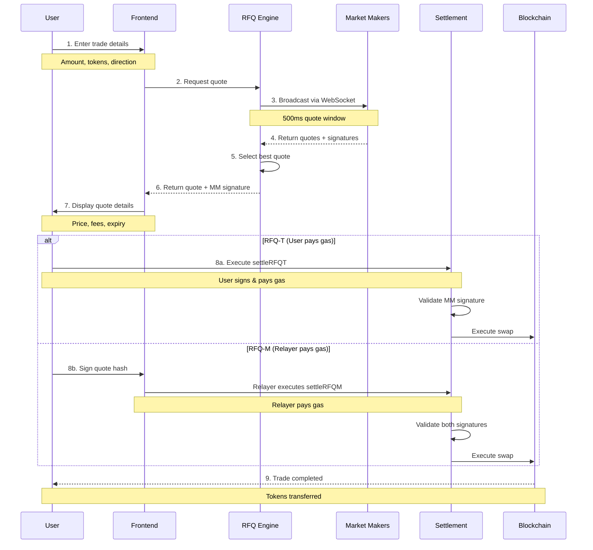

This guide walks through the complete trading flow on Crest, from quote request to settlement.

## Complete Trading Flow



## Quote Request & Response

### Quote Request Format
```json
{
  "tokenIn": "0x...",
  "tokenOut": "0x...",
  "amountIn": "1000000000000000000",
  "user": "0x...",
  "deadline": 1700000000
}
```

### Quote Response Format
```json
{
  "quoteId": "0x1234...",
  "user": "0x...",
  "tokenIn": "0x...",
  "tokenOut": "0x...",
  "amountIn": "1000000000000000000",
  "amountOut": "1950000000",
  "expiry": 1700000300,
  "signature": "0x...",
  "executionPrice": "1.945"
}
```

## Settlement Process

<Tabs>
  <Tab title="RFQ-T Settlement">
    **User-Initiated Settlement**

    ```typescript
    // Prepare transaction
    const txData = await settlementContract.populateTransaction.settleRFQT(
      {
        user: userAddress,
        marketMaker: quote.marketMaker,
        tokenIn: quote.tokenIn,
        tokenOut: quote.tokenOut,
        amountIn: quote.amountIn,
        amountOut: quote.amountOut,
        expiry: quote.expiry,
        quoteId: quote.quoteId
      },
      quote.signature,
      {
        value: quote.tokenIn === NATIVE_TOKEN ? quote.amountIn : 0
      }
    );

    // User signs and sends transaction
    const tx = await wallet.sendTransaction(txData);
    ```

    **Settlement Flow:**
    1. User approves ERC20 tokens (if needed)
    2. User sends transaction with quote parameters
    3. Contract validates market maker signature
    4. Tokens transfer directly between user and MM
    5. Settlement event emitted
  </Tab>

  <Tab title="RFQ-M Settlement">
    **Relayer-Initiated Settlement**

    ```typescript
    // User signs the quote hash
    const quoteHash = await settlementContract.hashQuote(
      quote.user,
      quote.tokenIn,
      quote.tokenOut,
      quote.amountIn,
      quote.amountOut,
      quote.expiry,
      quote.quoteId
    );

    const userSignature = await wallet.signMessage(
      ethers.utils.arrayify(quoteHash)
    );

    // Relayer executes the trade
    const tx = await settlementContract.settleRFQM(
      quoteParams,
      quote.marketMakerSignature,
      userSignature
    );
    ```

    **Settlement Flow:**
    1. User signs quote approval (off-chain)
    2. Relayer submits transaction with both signatures
    3. Contract validates both user and MM signatures
    4. Relayer pays gas fees
    5. Tokens settle according to quote terms
  </Tab>
</Tabs>

## Error Handling

<AccordionGroup>
  <Accordion title="Quote Expiration">
    **Scenario**: Quote execution attempted after expiry

    **Handling**:
    - Frontend prevents execution of expired quotes
    - Smart contract reverts with "Quote expired"
    - User prompted to request fresh quote
  </Accordion>

  <Accordion title="Insufficient Balance">
    **Scenario**: Insufficient tokens for trade

    **Handling**:
    - Balance checked before quote request
    - Real-time balance updates
    - Clear error messaging with required amount
  </Accordion>

  <Accordion title="Market Maker Unavailable">
    **Scenario**: No quotes received in 500ms window

    **Handling**:
    - Retry with exponential backoff
    - Fallback to alternative MMs
    - User notification with status
  </Accordion>

  <Accordion title="Signature Validation">
    **Scenario**: Invalid or mismatched signatures

    **Handling**:
    - Client-side signature verification
    - Contract-level validation
    - Clear error messaging for users
  </Accordion>
</AccordionGroup>
