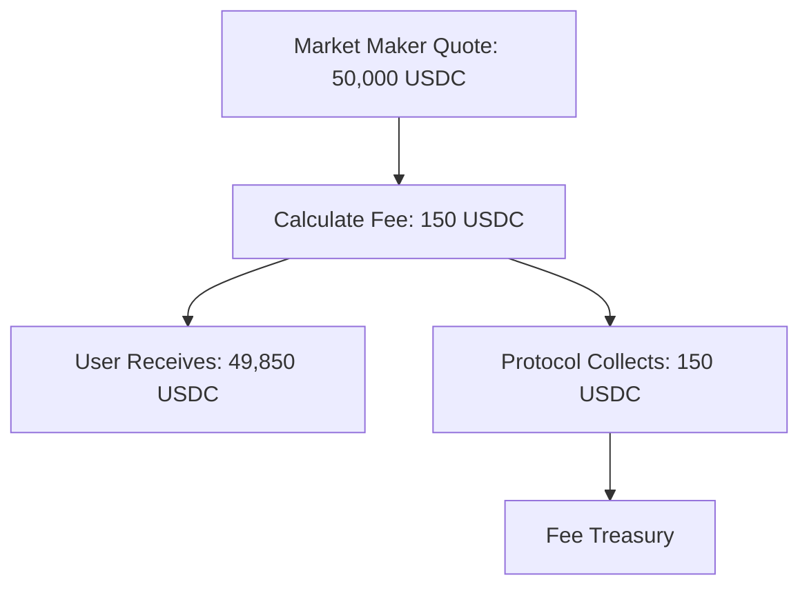

# Fee Structure

Crest implements a transparent and competitive fee structure designed to sustain the protocol while keeping costs minimal for users. This guide explains how fees work, how they're calculated, and strategies for optimization.

## Protocol Fee Overview

<CardGroup cols={2}>
  <Card title="Default Fee Rate" icon="percentage">
    **0.3%** (30 basis points) charged on the output amount of each trade
  </Card>
  <Card title="Fee Cap" icon="shield">
    **10%** maximum fee rate hard-coded in the smart contract for user protection
  </Card>
  <Card title="Fee Collection" icon="coins">
    Fees are collected in the **output token** and held in the Settlement contract
  </Card>
  <Card title="Fee Management" icon="gear">
    Fee rates can only be modified by the contract owner (protocol governance)
  </Card>
</CardGroup>

## How Fees Work

### Fee Calculation

```solidity
function _calculateFee(uint256 amountOut)
    private view returns (uint256 feeAmount, uint256 userReceiveAmount) {
    feeAmount = (amountOut * feeBasisPoints) / 10000;
    userReceiveAmount = amountOut - feeAmount;
}
```

**Example Calculation:**
- User trades 1 cBTC → receives quote for 50,000 USDC
- Fee calculation: `50,000 * 30 / 10000 = 150 USDC`
- User receives: `50,000 - 150 = 49,850 USDC`
- Protocol collects: `150 USDC`

### Fee Collection Process



## Fee Implementation Details

### Code Implementation

From the Settlement contract:

```solidity
// Fee configuration
uint256 public feeBasisPoints = 30; // 0.3% default
uint256 public constant MAX_FEE_BASIS_POINTS = 1000; // 10% cap

// Fee collection per token
mapping(address => uint256) public collectedFees;

// Fee deduction in settlement execution
if (params.tokenOut == NATIVE_TOKEN) {
    // For native cBTC output
    (bool success, ) = payable(params.user).call{value: userReceiveAmount}("");
    require(success, "cBTC transfer to user failed");

    // Collect fee in native cBTC
    if (feeAmount > 0) {
        collectedFees[NATIVE_TOKEN] += feeAmount;
    }
} else {
    // For ERC20 output
    IERC20(params.tokenOut).safeTransferFrom(
        params.marketMaker,
        params.user,
        userReceiveAmount
    );

    // Collect fee from market maker
    if (feeAmount > 0) {
        IERC20(params.tokenOut).safeTransferFrom(
            params.marketMaker,
            address(this),
            feeAmount
        );
        collectedFees[params.tokenOut] += feeAmount;
    }
}
```

### Fee Update Mechanism

```solidity
function setFeeBasisPoints(uint256 newFeeBasisPoints) external onlyOwner {
    require(newFeeBasisPoints <= MAX_FEE_BASIS_POINTS, "Fee too high");
    uint256 oldFee = feeBasisPoints;
    feeBasisPoints = newFeeBasisPoints;
    emit FeeUpdated(oldFee, newFeeBasisPoints);
}
```

## Fee Comparison

### Industry Comparison

| Platform | Fee Structure | Typical Fee |
|----------|---------------|-------------|
| **Crest** | **0.3% on output** | **~$1.50 on $500 trade** |
| Uniswap V3 | 0.05-1% + gas | ~$2-10 + $10-50 gas |
| 1inch | 0.1-0.3% + gas | ~$0.50-1.50 + $10-50 gas |
| Coinbase | 0.6% maker/taker | ~$3 on $500 trade |
| 0x Protocol | Gas only | ~$10-50 gas |

### Gas Cost Comparison

```typescript
// Approximate total costs (trade + gas) on different networks
const totalCosts = {
  crestOnCitrea: {
    fee: '0.3%', // $1.50 on $500 trade
    gas: '~$0.10', // ~150k gas at 1 gwei
    total: '~$1.60'
  },
  uniswapOnEthereum: {
    fee: '0.3%', // $1.50 on $500 trade
    gas: '~$20', // ~150k gas at 20 gwei, $3k ETH
    total: '~$21.50'
  },
  uniswapOnArbitrum: {
    fee: '0.3%', // $1.50 on $500 trade
    gas: '~$1', // Lower L2 gas costs
    total: '~$2.50'
  }
};
```

## Fee Optimization Strategies

### For Traders

<Tabs>
  <Tab title="Trade Size Optimization">
    Since fees are percentage-based, larger trades are more cost-efficient:

    ```typescript
    // Fee efficiency increases with trade size
    const feeEfficiency = {
      smallTrade: {
        amount: '$100',
        fee: '$0.30',
        feePercent: '0.30%'
      },
      largeTrade: {
        amount: '$10,000',
        fee: '$30',
        feePercent: '0.30%' // Same percentage, better absolute efficiency
      }
    };
    ```
  </Tab>

  <Tab title="Gas Cost Amortization">
    Bundle multiple operations to amortize gas costs:

    ```typescript
    // Instead of multiple small trades
    const multipleSmallTrades = {
      trades: 5,
      tradeSize: '$100 each',
      totalFees: '$1.50',
      totalGas: '$0.50', // 5 × $0.10
      totalCost: '$2.00'
    };

    // Use single larger trade
    const singleLargeTrade = {
      trades: 1,
      tradeSize: '$500',
      totalFees: '$1.50',
      totalGas: '$0.10', // 1 × $0.10
      totalCost: '$1.60' // 20% savings
    };
    ```
  </Tab>

  <Tab title="Timing Optimization">
    Monitor gas prices for optimal execution timing:

    ```typescript
    // Gas price monitoring
    const gasOptimization = {
      peakHours: {
        gasPrice: '2 gwei',
        tradeCost: '$0.20',
        recommendation: 'Avoid if possible'
      },
      offPeakHours: {
        gasPrice: '0.5 gwei',
        tradeCost: '$0.05',
        recommendation: 'Optimal timing'
      }
    };
    ```
  </Tab>
</Tabs>

### For Market Makers

<AccordionGroup>
  <Accordion title="Spread Adjustment">
    Account for protocol fees in your pricing:

    ```typescript
    function calculateQuoteWithFees(basePrice: number, protocolFee: number = 0.003): number {
      // Adjust quote to account for protocol fee
      const adjustedPrice = basePrice * (1 + protocolFee);
      return adjustedPrice;
    }
    ```
  </Accordion>

  <Accordion title="Volume-Based Strategies">
    Optimize for volume to maximize absolute returns despite percentage fees:

    ```typescript
    const volumeStrategy = {
      highVolumeLowMargin: {
        spread: '0.1%',
        volume: '$1M daily',
        grossProfit: '$1,000',
        netProfit: '$700' // After 30% to protocol
      },
      lowVolumeHighMargin: {
        spread: '0.5%',
        volume: '$200k daily',
        grossProfit: '$1,000',
        netProfit: '$700' // Same net, different strategy
      }
    };
    ```
  </Accordion>

  <Accordion title="Token Selection">
    Focus on tokens where you can provide competitive post-fee pricing:

    ```typescript
    // Evaluate competitiveness including fees
    function evaluateTokenPair(pair: TokenPair): boolean {
      const marketPrice = getMarketPrice(pair);
      const yourQuote = generateQuote(pair);
      const postFeeQuote = yourQuote * 0.997; // Account for 0.3% fee

      return postFeeQuote >= marketPrice * 0.999; // Competitive threshold
    }
    ```
  </Accordion>
</AccordionGroup>

## Fee Collection and Management

### Fee Withdrawal (Owner Only)

```solidity
function withdrawFees(address token, address to) external onlyOwner {
    require(to != address(0), "Invalid recipient");
    uint256 amount = collectedFees[token];
    require(amount > 0, "No fees to withdraw");

    collectedFees[token] = 0;

    if (token == NATIVE_TOKEN) {
        (bool success, ) = payable(to).call{value: amount}("");
        require(success, "cBTC transfer failed");
    } else {
        IERC20(token).safeTransfer(to, amount);
    }

    emit FeesWithdrawn(token, to, amount);
}
```

### Fee Distribution (Future)

Potential future fee distribution mechanisms:

<CardGroup cols={2}>
  <Card title="Protocol Governance" icon="vote">
    Fee allocation decisions made through decentralized governance
  </Card>
  <Card title="Stakeholder Rewards" icon="gift">
    Portion of fees distributed to protocol stakeholders
  </Card>
  <Card title="Development Fund" icon="code">
    Fees funding continued protocol development
  </Card>
  <Card title="Market Maker Incentives" icon="handshake">
    Rebates for high-volume market makers
  </Card>
</CardGroup>

## Fee Analytics

### Tracking Fee Metrics

```typescript
interface FeeMetrics {
  totalFeesCollected: Map<string, BigNumber>; // Per token
  dailyFeeVolume: BigNumber;
  averageFeePerTrade: BigNumber;
  feeEfficiency: number; // Fees vs gas costs
}

class FeeAnalytics {
  trackTradeFee(trade: Trade) {
    const feeAmount = trade.amountOut.mul(30).div(10000);
    this.updateMetrics(trade.tokenOut, feeAmount);
  }

  calculateFeeEfficiency(): number {
    const totalFees = this.getTotalDailyFees();
    const totalGas = this.getTotalDailyGas();
    return totalFees.div(totalGas).toNumber();
  }
}
```

### Fee Monitoring Dashboard

Essential metrics to track:

1. **Daily fee collection** by token
2. **Average fee per trade**
3. **Fee-to-gas ratio** efficiency
4. **Market maker fee burden** analysis
5. **Competitive fee positioning** vs other protocols

## Security Considerations

### Fee-Related Attack Vectors

<AccordionGroup>
  <Accordion title="Fee Manipulation">
    **Risk**: Manipulating fee rates through governance attacks

    **Mitigation**:
    - Hard-coded maximum fee of 10%
    - Time delays on fee changes
    - Multi-signature governance requirements
  </Accordion>

  <Accordion title="Fee Avoidance">
    **Risk**: Attempting to trade without paying fees

    **Mitigation**:
    - Fees calculated and deducted in settlement logic
    - No way to bypass fee collection
    - Atomic transaction ensures fee payment
  </Accordion>

  <Accordion title="Precision Issues">
    **Risk**: Rounding errors in fee calculations

    **Mitigation**:
    - Use of basis points (1/10000) for precision
    - Solidity 0.8+ overflow protection
    - Comprehensive testing of edge cases
  </Accordion>
</AccordionGroup>

### Audit Considerations

Key areas for fee-related auditing:

1. **Mathematical accuracy** of fee calculations
2. **Access control** on fee management functions
3. **Reentrancy protection** in fee collection
4. **Integer overflow/underflow** prevention
5. **Gas optimization** in fee logic

## Future Fee Developments

### Planned Improvements

<Tabs>
  <Tab title="Dynamic Fees">
    Implement market-responsive fee mechanisms:

    ```solidity
    function calculateDynamicFee(
        uint256 tradeSize,
        uint256 marketVolatility,
        uint256 networkUsage
    ) pure returns (uint256) {
        uint256 baseFee = 30; // 0.3%
        uint256 sizeFactor = getSizeFactor(tradeSize);
        uint256 volatilityFactor = getVolatilityFactor(marketVolatility);

        return baseFee + sizeFactor + volatilityFactor;
    }
    ```
  </Tab>

  <Tab title="Volume Discounts">
    Reward high-volume users with reduced fees:

    ```solidity
    mapping(address => uint256) public userVolume;

    function getUserFeeRate(address user) view returns (uint256) {
        uint256 volume = userVolume[user];
        if (volume > 1000 ether) return 20; // 0.2% for high volume
        if (volume > 100 ether) return 25;  // 0.25% for medium volume
        return 30; // 0.3% default
    }
    ```
  </Tab>

  <Tab title="Token-Specific Fees">
    Different fee rates for different token types:

    ```solidity
    mapping(address => uint256) public tokenFeeRates;

    function getTokenFeeRate(address token) view returns (uint256) {
        uint256 customRate = tokenFeeRates[token];
        return customRate > 0 ? customRate : feeBasisPoints;
    }
    ```
  </Tab>
</Tabs>

## Integration Guidelines

### For Frontend Developers

```typescript
// Always show fees clearly to users
const TradeSummary: React.FC<{quote: Quote}> = ({quote}) => {
  const feeAmount = calculateFee(quote.amountOut);
  const userReceives = quote.amountOut.sub(feeAmount);

  return (
    <div>
      <div>Quote: {formatAmount(quote.amountOut)} {quote.tokenOut}</div>
      <div>Protocol Fee (0.3%): {formatAmount(feeAmount)} {quote.tokenOut}</div>
      <div>You Receive: {formatAmount(userReceives)} {quote.tokenOut}</div>
    </div>
  );
};
```

### For Backend Integrators

```typescript
// Account for fees in quote validation
function validateQuote(quote: Quote, minReceive: BigNumber): boolean {
  const feeAmount = quote.amountOut.mul(30).div(10000);
  const userReceives = quote.amountOut.sub(feeAmount);

  return userReceives.gte(minReceive);
}
```

## Next Steps

Understanding Crest's fee structure:

- [RFQ-T Trading](/trading/rfqt) - See how fees apply to user-initiated trades
- [RFQ-M Trading](/trading/rfqm) - Understand fees in relayer-initiated trades
- [Market Maker Integration](/integration/market-makers) - How MMs should account for fees