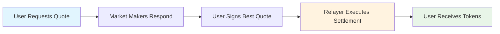
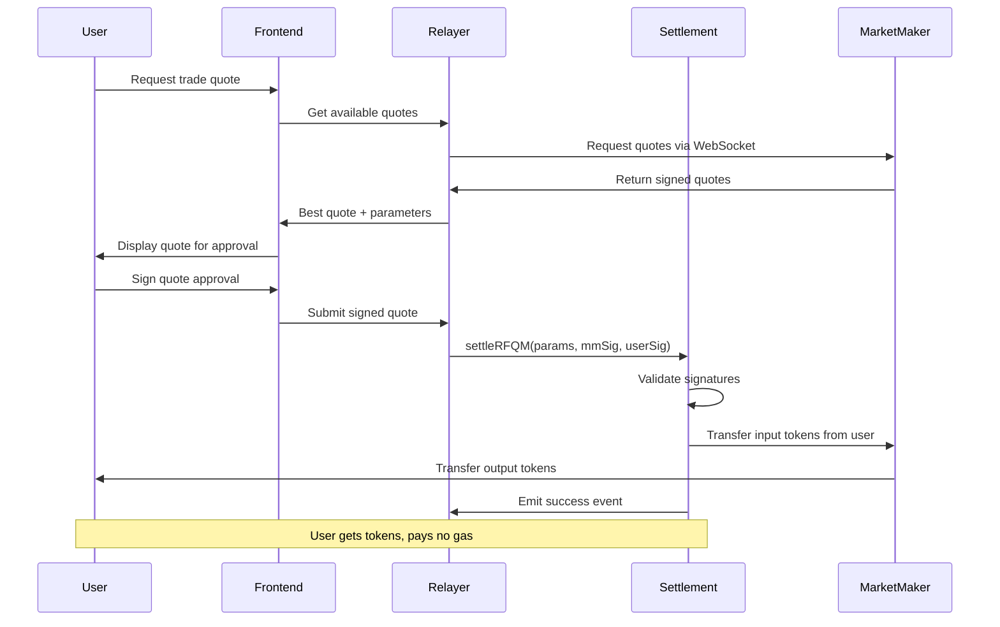
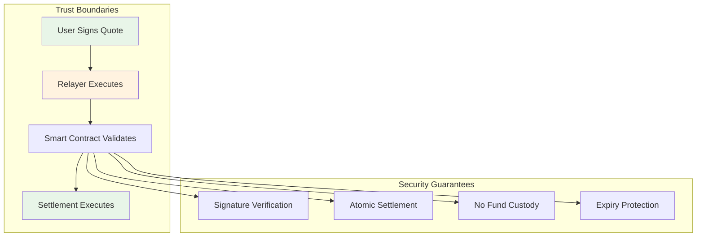

# RFQ-M (Relayer-Initiated Settlement)

**RFQ-M** represents Crest's **gas abstraction layer**, enabling users to trade Bitcoin with **zero gas fees** while maintaining full self-custody. Relayers handle gas payments and settlement execution on behalf of users, creating a seamless trading experience similar to centralized exchanges.

## Overview

### What is RFQ-M?

RFQ-M (Request for Quote - Market Maker initiated) is a settlement mechanism where:

- **Users** sign quotes off-chain (no gas required)
- **Relayers** pay gas fees and execute settlements
- **Market makers** provide liquidity and sign quotes
- **Smart contracts** ensure trustless execution



### Key Benefits

<CardGroup cols={2}>
  <Card title="Zero Gas Fees" icon="dollar-sign">
    Users never pay gas - relayers handle all transaction costs
  </Card>
  <Card title="Native cBTC Support" icon="bitcoin">
    Direct Bitcoin trading without bridges or wrapped tokens
  </Card>
  <Card title="Self-Custodial" icon="shield">
    Users maintain full control - no funds held by relayers
  </Card>
  <Card title="Instant Settlement" icon="zap">
    Sub-second execution once quotes are signed
  </Card>
</CardGroup>

## How RFQ-M Works

### Settlement Flow



### Signature Requirements

RFQ-M requires **dual signatures** for security:

<Tabs>
  <Tab title="Market Maker Signature">
    ```typescript
    // Market maker signs the quote parameters
    const mmSignature = await marketMaker.signTypedData({
      domain: DOMAIN,
      types: QUOTE_TYPES,
      value: {
        user: userAddress,
        marketMaker: mmAddress,
        tokenIn: tokenInAddress,
        tokenOut: tokenOutAddress,
        amountIn: amountIn,
        amountOut: amountOut,
        expiry: expiry,
        quoteId: quoteId
      }
    });
    ```
  </Tab>
  <Tab title="User Signature">
    ```typescript
    // User signs approval for the specific quote
    const userSignature = await user.signTypedData({
      domain: DOMAIN,
      types: QUOTE_TYPES,
      value: {
        user: userAddress,
        marketMaker: mmAddress,
        tokenIn: tokenInAddress,
        tokenOut: tokenOutAddress,
        amountIn: amountIn,
        amountOut: amountOut,
        expiry: expiry,
        quoteId: quoteId
      }
    });
    ```
  </Tab>
  <Tab title="Settlement Execution">
    ```solidity
    // Settlement contract validates both signatures
    function settleRFQM(
        QuoteParams calldata params,
        bytes calldata mmSignature,
        bytes calldata userSignature
    ) external payable nonReentrant {
        bytes32 hash = hashQuote(params);

        // Validate market maker signature
        require(
            validateSignature(params.marketMaker, hash, mmSignature),
            "Invalid MM signature"
        );

        // Validate user signature
        require(
            validateSignature(params.user, hash, userSignature),
            "Invalid user signature"
        );

        _executeSettlement(params);
    }
    ```
  </Tab>
</Tabs>

## Implementation Guide

### Frontend Integration

```typescript
// RFQ-M quote request flow
class RFQMService {
  async requestQuote(params: QuoteRequest): Promise<RFQMQuote> {
    // 1. Request quotes from relayer
    const response = await fetch('/api/quotes/rfqm', {
      method: 'POST',
      headers: { 'Content-Type': 'application/json' },
      body: JSON.stringify({
        tokenIn: params.tokenIn,
        tokenOut: params.tokenOut,
        amountIn: params.amountIn,
        userAddress: params.userAddress
      })
    });

    const { quote, marketMakerSignature } = await response.json();

    return {
      params: quote,
      mmSignature: marketMakerSignature,
      expiry: quote.expiry,
      estimatedGas: 0 // User pays no gas
    };
  }

  async executeQuote(quote: RFQMQuote, userWallet: Wallet): Promise<string> {
    // 2. User signs the quote
    const userSignature = await userWallet.signTypedData({
      domain: EIP712_DOMAIN,
      types: QUOTE_TYPES,
      value: quote.params
    });

    // 3. Submit to relayer for execution
    const response = await fetch('/api/execute/rfqm', {
      method: 'POST',
      headers: { 'Content-Type': 'application/json' },
      body: JSON.stringify({
        params: quote.params,
        mmSignature: quote.mmSignature,
        userSignature: userSignature
      })
    });

    const { transactionHash } = await response.json();
    return transactionHash;
  }
}
```

### Relayer Implementation

```typescript
// Relayer service for RFQ-M execution
class RFQMRelayer {
  async processQuoteRequest(request: QuoteRequest): Promise<QuoteResponse> {
    // 1. Broadcast to market makers
    const quotes = await this.broadcastToMarketMakers(request);

    // 2. Select best quote
    const bestQuote = this.selectBestQuote(quotes);

    // 3. Return quote with MM signature
    return {
      quote: bestQuote.params,
      mmSignature: bestQuote.signature,
      relayerFee: this.calculateRelayerFee(bestQuote),
      expiry: bestQuote.expiry
    };
  }

  async executeSettlement(
    params: QuoteParams,
    mmSignature: string,
    userSignature: string
  ): Promise<string> {
    // 1. Validate signatures locally
    const hash = this.hashQuote(params);
    if (!this.validateSignature(params.marketMaker, hash, mmSignature)) {
      throw new Error('Invalid market maker signature');
    }
    if (!this.validateSignature(params.user, hash, userSignature)) {
      throw new Error('Invalid user signature');
    }

    // 2. Check quote expiry
    if (Date.now() > params.expiry * 1000) {
      throw new Error('Quote expired');
    }

    // 3. Execute settlement transaction
    const settlement = new ethers.Contract(
      SETTLEMENT_ADDRESS,
      SETTLEMENT_ABI,
      this.wallet
    );

    const tx = await settlement.settleRFQM(
      params,
      mmSignature,
      userSignature,
      {
        gasLimit: 200000,
        gasPrice: await this.getOptimalGasPrice()
      }
    );

    return tx.hash;
  }

  private calculateRelayerFee(quote: Quote): bigint {
    // Relayer fee covers gas + small profit margin
    const gasEstimate = 150000n; // ~150K gas per settlement
    const gasPriceWei = 1000000000n; // 1 gwei on Citrea
    const gasCost = gasEstimate * gasPriceWei;
    const profitMargin = gasCost / 10n; // 10% profit margin

    return gasCost + profitMargin;
  }
}
```

### Market Maker Integration

```typescript
// Market maker RFQ-M quote generation
class MarketMakerRFQM {
  async generateQuote(request: QuoteRequest): Promise<SignedQuote> {
    // 1. Calculate output amount based on current prices
    const outputAmount = await this.calculateOutputAmount(
      request.tokenIn,
      request.tokenOut,
      request.amountIn
    );

    // 2. Apply spread and fees
    const adjustedAmount = this.applySpread(outputAmount, request);

    // 3. Create quote parameters
    const params: QuoteParams = {
      user: request.userAddress,
      marketMaker: this.address,
      tokenIn: request.tokenIn,
      tokenOut: request.tokenOut,
      amountIn: request.amountIn,
      amountOut: adjustedAmount,
      expiry: Math.floor(Date.now() / 1000) + 30, // 30 second expiry
      quoteId: this.generateQuoteId()
    };

    // 4. Sign the quote
    const signature = await this.signQuote(params);

    return { params, signature };
  }

  private async signQuote(params: QuoteParams): Promise<string> {
    return await this.wallet.signTypedData({
      domain: EIP712_DOMAIN,
      types: QUOTE_TYPES,
      value: params
    });
  }

  private applySpread(baseAmount: bigint, request: QuoteRequest): bigint {
    // Apply different spreads based on market conditions
    const spread = this.calculateSpread(request.tokenIn, request.tokenOut);
    const spreadAmount = (baseAmount * BigInt(spread)) / 10000n;

    return baseAmount - spreadAmount;
  }
}
```

## Gas Economics

### Cost Structure

<Tabs>
  <Tab title="User Perspective">
    ```typescript
    // User pays ZERO gas fees
    const userCosts = {
      gasFees: 0,           // Relayer covers all gas
      tradingFees: 0.003,   // 0.3% protocol fee
      spreadCosts: 0.001,   // ~0.1% market maker spread
      totalCost: 0.004      // ~0.4% total cost
    };
    ```
  </Tab>
  <Tab title="Relayer Economics">
    ```typescript
    // Relayer cost/revenue analysis
    const relayerEconomics = {
      gasCost: 150000 * 1e9,      // 150K gas at 1 gwei = 0.00015 cBTC
      relayerFee: 0.000165,       // 10% markup = 0.000165 cBTC
      profitPerTrade: 0.000015,   // 0.000015 cBTC profit
      breakEvenVolume: 1000       // trades/day to be profitable
    };
    ```
  </Tab>
  <Tab title="Market Maker View">
    ```typescript
    // Market maker receives spread
    const marketMakerRewards = {
      spread: 0.001,          // ~0.1% spread on trades
      volumeBonus: 0.0005,    // Additional rewards for high volume
      gasRebate: 0,           // No gas costs in RFQ-M
      totalRevenue: 0.0015    // ~0.15% per trade
    };
    ```
  </Tab>
</Tabs>

### Relayer Incentives

```typescript
// Dynamic fee adjustment based on network conditions
class RelayerFeeManager {
  calculateDynamicFee(networkConditions: NetworkState): bigint {
    const baseFee = 150000n * this.getCurrentGasPrice();

    // Adjust based on network congestion
    const congestionMultiplier = networkConditions.congestionLevel > 0.8
      ? 150n  // 50% markup during high congestion
      : 110n; // 10% markup normal conditions

    return (baseFee * congestionMultiplier) / 100n;
  }

  async optimizeGasPrice(): Promise<bigint> {
    // Use EIP-1559 for optimal gas pricing
    const { baseFeePerGas, maxPriorityFeePerGas } = await this.getGasOracle();

    return baseFeePerGas + maxPriorityFeePerGas;
  }
}
```

## Security Considerations

### Signature Security

<Warning>
**Critical Security Requirements**

- Both market maker AND user signatures required
- Signatures must match exact quote parameters
- Quote expiry prevents replay attacks
- Unique quote IDs prevent double-execution
</Warning>

```solidity
// Settlement contract security validations
function settleRFQM(
    QuoteParams calldata params,
    bytes calldata mmSignature,
    bytes calldata userSignature
) external payable nonReentrant {
    // 1. Validate quote hasn't been executed
    require(!executedQuotes[params.quoteId], "Quote already executed");

    // 2. Check expiry
    require(block.timestamp <= params.expiry, "Quote expired");

    // 3. Validate both signatures
    bytes32 hash = hashQuote(params);
    require(validateSignature(params.marketMaker, hash, mmSignature), "Invalid MM sig");
    require(validateSignature(params.user, hash, userSignature), "Invalid user sig");

    // 4. Mark as executed BEFORE external calls
    executedQuotes[params.quoteId] = true;

    // 5. Execute settlement
    _executeSettlement(params);
}
```

### Relayer Trust Model



### Attack Vectors & Mitigations

<AccordionGroup>
  <Accordion title="Relayer Front-Running">
    **Risk**: Relayer sees profitable trade and front-runs user

    **Mitigation**:
    - User signature locks in specific quote
    - Quote expiry limits time window
    - Slippage protection in quotes
  </Accordion>

  <Accordion title="Market Maker Collusion">
    **Risk**: Market makers provide poor quotes to users

    **Mitigation**:
    - Multiple market makers compete
    - Users can reject quotes
    - Transparent quote comparison
  </Accordion>

  <Accordion title="Signature Replay">
    **Risk**: Attacker reuses valid signatures

    **Mitigation**:
    - Unique quote IDs prevent replay
    - Expiry timestamps limit validity
    - Nonce-based quote generation
  </Accordion>

  <Accordion title="Relayer Griefing">
    **Risk**: Relayer accepts quotes but doesn't execute

    **Mitigation**:
    - Multiple relayer options
    - Relayer reputation system
    - Client-side timeout handling
  </Accordion>
</AccordionGroup>

## User Experience Optimizations

### Progressive Enhancement

```typescript
// Graceful fallback from RFQ-M to RFQ-T
class AdaptiveTrading {
  async executeTrade(params: TradeParams): Promise<TradeResult> {
    try {
      // 1. Try RFQ-M first (zero gas)
      return await this.executeRFQM(params);
    } catch (error) {
      if (error.code === 'RELAYER_UNAVAILABLE') {
        // 2. Fallback to RFQ-T (user pays gas)
        console.log('Relayer unavailable, falling back to direct settlement');
        return await this.executeRFQT(params);
      }
      throw error;
    }
  }

  private async executeRFQM(params: TradeParams): Promise<TradeResult> {
    // Implementation for gasless trading
    return this.rfqmService.execute(params);
  }

  private async executeRFQT(params: TradeParams): Promise<TradeResult> {
    // Implementation for direct user settlement
    return this.rfqtService.execute(params);
  }
}
```

### Real-Time Status Updates

```typescript
// WebSocket integration for real-time trade status
class TradeStatusTracker {
  trackRFQMTrade(quoteId: string): Observable<TradeStatus> {
    return new Observable(observer => {
      const ws = new WebSocket(`wss://api.crest.app/trades/${quoteId}/status`);

      ws.onmessage = (event) => {
        const status = JSON.parse(event.data);
        observer.next({
          stage: status.stage,     // 'quoted' | 'signed' | 'submitted' | 'confirmed'
          txHash: status.txHash,
          gasUsed: status.gasUsed,
          timestamp: status.timestamp
        });
      };

      return () => ws.close();
    });
  }
}
```

## Integration Examples

### React Component

```tsx
// React component for RFQ-M trading
export function RFQMTradeWidget() {
  const [quote, setQuote] = useState<RFQMQuote | null>(null);
  const [isTrading, setIsTrading] = useState(false);
  const { account, signTypedData } = useWallet();

  const handleGetQuote = async () => {
    const rfqmService = new RFQMService();

    const newQuote = await rfqmService.requestQuote({
      tokenIn: selectedTokenIn,
      tokenOut: selectedTokenOut,
      amountIn: inputAmount,
      userAddress: account
    });

    setQuote(newQuote);
  };

  const handleExecuteTrade = async () => {
    if (!quote || !account) return;

    setIsTrading(true);
    try {
      // User signs the quote (no gas required)
      const userSignature = await signTypedData({
        domain: EIP712_DOMAIN,
        types: QUOTE_TYPES,
        value: quote.params
      });

      // Submit to relayer for execution
      const txHash = await fetch('/api/execute/rfqm', {
        method: 'POST',
        headers: { 'Content-Type': 'application/json' },
        body: JSON.stringify({
          params: quote.params,
          mmSignature: quote.mmSignature,
          userSignature
        })
      }).then(r => r.json());

      console.log('Trade executed:', txHash);
    } catch (error) {
      console.error('Trade failed:', error);
    } finally {
      setIsTrading(false);
    }
  };

  return (
    <div className="rfqm-widget">
      <div className="quote-section">
        <button onClick={handleGetQuote}>
          Get Quote (Gas Free!)
        </button>

        {quote && (
          <div className="quote-display">
            <p>Rate: {formatRate(quote.params.amountOut, quote.params.amountIn)}</p>
            <p>Expires: {formatExpiry(quote.params.expiry)}</p>
            <p className="gas-free">✅ No gas fees required</p>
          </div>
        )}
      </div>

      {quote && (
        <button
          onClick={handleExecuteTrade}
          disabled={isTrading}
          className="execute-button"
        >
          {isTrading ? 'Executing...' : 'Execute Trade (Free)'}
        </button>
      )}
    </div>
  );
}
```

## Performance Metrics

### Benchmarks

<CardGroup cols={3}>
  <Card title="Quote Generation" icon="clock">
    **< 500ms**

    From request to signed quote
  </Card>
  <Card title="Settlement Time" icon="zap">
    **< 2 seconds**

    From user signature to confirmation
  </Card>
  <Card title="Gas Efficiency" icon="leaf">
    **~150K gas**

    Per settlement transaction
  </Card>
</CardGroup>

### Monitoring Dashboard

```typescript
// Analytics for RFQ-M performance
interface RFQMMetrics {
  dailyVolume: bigint;
  averageQuoteTime: number;     // milliseconds
  averageSettlementTime: number; // seconds
  relayerUptime: number;        // percentage
  userSatisfactionScore: number; // 1-10 scale
  gasEfficiency: number;        // gas per $1000 volume
}

class RFQMAnalytics {
  async getMetrics(timeframe: string): Promise<RFQMMetrics> {
    const events = await this.getSettlementEvents(timeframe);

    return {
      dailyVolume: this.calculateVolume(events),
      averageQuoteTime: this.calculateAverageQuoteTime(events),
      averageSettlementTime: this.calculateAverageSettlementTime(events),
      relayerUptime: await this.getRelayerUptime(timeframe),
      userSatisfactionScore: await this.getUserSatisfactionScore(timeframe),
      gasEfficiency: this.calculateGasEfficiency(events)
    };
  }
}
```

## Comparison: RFQ-M vs RFQ-T

| Feature | RFQ-M | RFQ-T |
|---------|--------|--------|
| **Gas Fees** | Zero (relayer pays) | User pays (~$0.10) |
| **Settlement Speed** | ~2 seconds | ~15 seconds |
| **Setup Complexity** | High (relayer needed) | Low (direct to contract) |
| **UX Quality** | Excellent (CEX-like) | Good (standard DeFi) |
| **Decentralization** | Lower (relayer dependency) | Higher (direct execution) |
| **Availability** | Depends on relayers | Always available |

## Future Enhancements

### Planned Features

<AccordionGroup>
  <Accordion title="Cross-Chain RFQ-M">
    - Multi-chain relayer network
    - Unified liquidity across chains
    - Atomic cross-chain settlements
  </Accordion>

  <Accordion title="Relayer Competition">
    - Multiple relayer options per trade
    - Dynamic fee competition
    - Relayer reputation scoring
  </Accordion>

  <Accordion title="Advanced Gas Optimization">
    - EIP-4337 account abstraction
    - Batch settlement support
    - MEV-protected execution
  </Accordion>

  <Accordion title="Enhanced Privacy">
    - Private mempool submission
    - Encrypted quote requests
    - Anonymous relayer selection
  </Accordion>
</AccordionGroup>

## Next Steps

Understanding RFQ-M integration:

- [Fee Structure](/trading/fees) - Understanding all costs and economics
- [RFQ-T Settlement](/trading/rfqt) - Alternative direct settlement method
- [Market Maker Guide](/integration/market-makers) - How to provide liquidity for RFQ-M