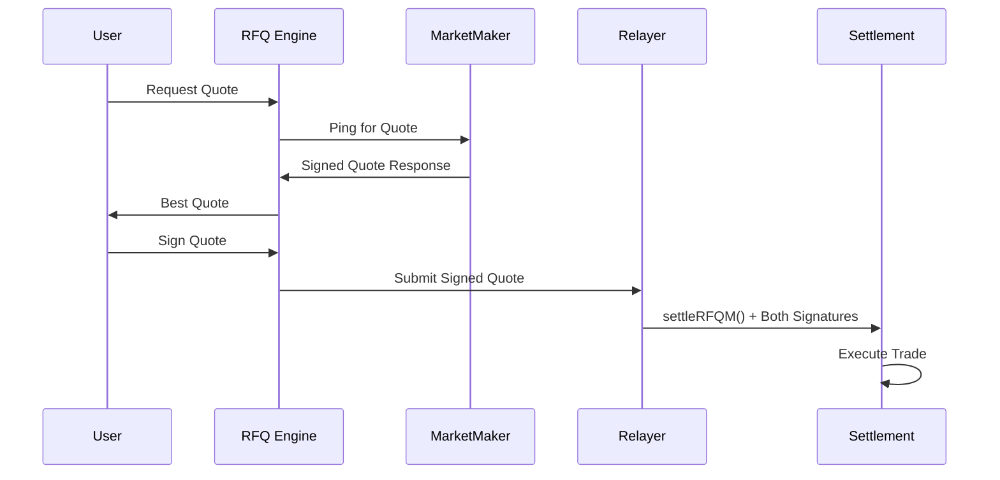
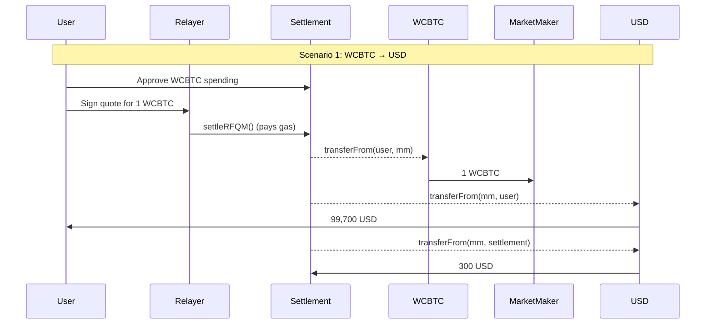
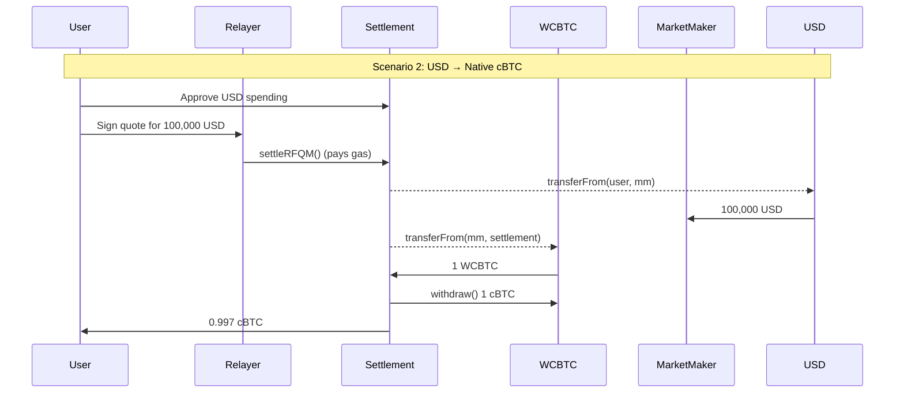
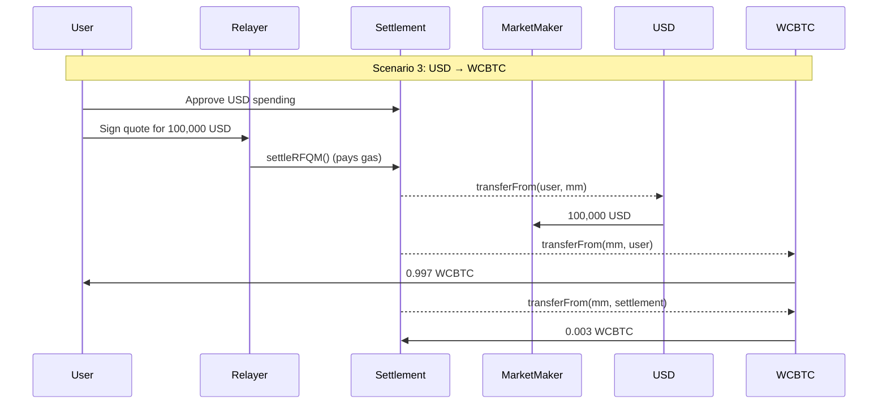

RFQ-M (Request for Quote - Market Maker) is Crest's **gas abstraction mechanism** where relayers execute trades on behalf of users. This mode enables zero-gas trading while maintaining self-custody of funds.

## Key Characteristics

<CardGroup cols={2}>
  <Card title="Gas Abstraction" icon="gas-pump">
    Relayers pay gas fees, enabling zero-gas trading for users
  </Card>
  <Card title="Dual Signatures" icon="signature">
    Requires both user and market maker signatures for security
  </Card>
  <Card title="Native cBTC Support" icon="bitcoin">
    Unique support for native cBTC as output token
  </Card>
  <Card title="Relayer Execution" icon="bolt">
    Professional relayers ensure fast and reliable settlement
  </Card>
</CardGroup>

## How RFQ-M Works

### 1. Quote Request & Response



### 2. Settlement Function Call

```solidity
function settleRFQM(
    QuoteParams calldata params,
    bytes calldata marketMakerSignature,
    bytes calldata userSignature
) external payable nonReentrant {
    require(!executedQuotes[params.quoteId], "Quote already executed");
    _validateRFQM(params, marketMakerSignature, userSignature);
    _executeRFQM(params);
}
```

## Trade Execution Scenarios

### Scenario 1: WCBTC → USD



**Execution Flow:**
1. User approves WCBTC spending and signs quote
2. Settlement uses transferFrom to:
   - Move 1 WCBTC from user to MM
   - Move 99,700 USD from MM to user
   - Move 300 USD fee from MM to itself

### Scenario 2: USD → Native cBTC



**Execution Flow:**
1. User approves USD spending and signs quote
2. Settlement uses transferFrom to move USD to MM
3. Settlement gets WCBTC from MM, unwraps it:
   - Sends 0.997 cBTC to user
   - Keeps 0.003 cBTC as fee

### Scenario 3: USD → WCBTC



## Technical Implementation

### Validation Process

```solidity
function _validateRFQM(
    QuoteParams memory params,
    bytes calldata marketMakerSignature,
    bytes calldata userSignature
) private {
    // Prevent replay attacks
    require(!executedQuotes[params.quoteId], "Quote already executed");

    // Check expiration
    require(block.timestamp <= params.expiry, "Quote expired");

    // Native cBTC not supported as input token in RFQ-M
    require(params.tokenIn != NATIVE_TOKEN, "Native cBTC not supported as input in RFQ-M");

    // Validate both signatures
    bytes32 quoteHash = hashQuote(params);
    require(
        validateSignature(params.marketMaker, quoteHash, marketMakerSignature),
        "Invalid market maker signature"
    );
    require(
        validateSignature(params.user, quoteHash, userSignature),
        "Invalid user signature"
    );

    // Mark as executed
    executedQuotes[params.quoteId] = true;
}
```

### Execution Logic

```solidity
function _executeRFQM(QuoteParams memory params) private {
    (uint256 feeAmount, uint256 userReceiveAmount) = _calculateFee(params.amountOut);

    // Handle input token (never native cBTC)
    IERC20(params.tokenIn).safeTransferFrom(
        params.user,
        params.marketMaker,
        params.amountIn
    );

    // Handle output token
    if (params.tokenOut == NATIVE_TOKEN) {
        // Output is native cBTC
        IERC20(address(wcbtc)).safeTransferFrom(
            params.marketMaker,
            address(this),
            params.amountOut
        );
        wcbtc.withdraw(params.amountOut);
        (bool success, ) = payable(params.user).call{value: userReceiveAmount}("");
        require(success, "cBTC transfer to user failed");

        if (feeAmount > 0) {
            collectedFees[NATIVE_TOKEN] += feeAmount;
        }
    } else {
        // Output is an ERC20 token
        IERC20(params.tokenOut).safeTransferFrom(
            params.marketMaker,
            params.user,
            userReceiveAmount
        );

        if (feeAmount > 0) {
            IERC20(params.tokenOut).safeTransferFrom(
                params.marketMaker,
                address(this),
                feeAmount
            );
            collectedFees[params.tokenOut] += feeAmount;
        }
    }

    emit RFQSettled(/* ... */, false); // isRFQT = false
}
```

## User Experience Considerations

### Pre-Execution Checks

Before executing RFQ-M trades, we verify:

<AccordionGroup>
  <Accordion title="1. Balance Check">
    **For Native cBTC:**
    - Verify wallet has sufficient cBTC balance
    - No extra buffer needed for gas
    - Example: For 1 cBTC trade ($100,000), ensure balance ≥ 1 cBTC

    **For ERC20 Tokens:**
    - Check token balance matches trade amount
    - Example: For 100,000 USDC trade, verify USDC balance ≥ 100,000
  </Accordion>

  <Accordion title="2. Token Approval">
    **When trading ERC20 tokens:**
    - Check if Settlement contract has sufficient allowance
    - Current allowance should be ≥ trade amount
    - If insufficient:
      1. Call approve() on token contract
      2. Set allowance for Settlement contract address
      3. Wait for approval transaction to confirm

    **Note:** Not required for native cBTC trades
  </Accordion>

  <Accordion title="3. Quote Validation">
    **Expiration:**
    - Check current timestamp vs quote expiry
    - Quotes typically valid for 3-4 seconds
    - Request new quote if expired
  </Accordion>

  <Accordion title="4. Relayer Status">
    **Ensure sufficient cBTC for gas:**
    - Check relayer is online and responsive
    - Verify relayer has sufficient gas balance
    - Monitor relayer response times
  </Accordion>
</AccordionGroup>

### Error Handling

Common errors and their resolutions:

<AccordionGroup>
  <Accordion title="Insufficient Balance">
    **Error**: "Insufficient token balance"

    **Resolution**:
    - Check token balance matches trade amount
    - No need to check for gas balance
    - Consider reducing trade size if needed
  </Accordion>

  <Accordion title="Quote Expired">
    **Error**: "Quote expired"

    **Resolution**:
    - Request a new quote from the RFQ system
    - Execute trades promptly after receiving quotes
    - Consider implementing quote refresh functionality
  </Accordion>

  <Accordion title="Insufficient Allowance">
    **Error**: "ERC20: insufficient allowance"

    **Resolution**:
    - Approve the Settlement contract to spend tokens
    - Use `approve()` or `increaseAllowance()`
    - Consider unlimited approval for frequent trading
  </Accordion>
</AccordionGroup>