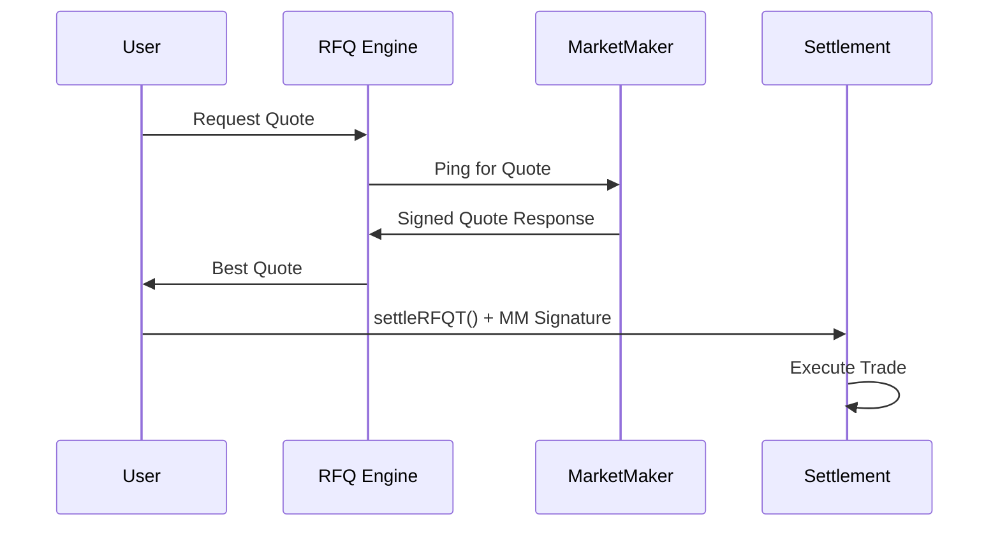
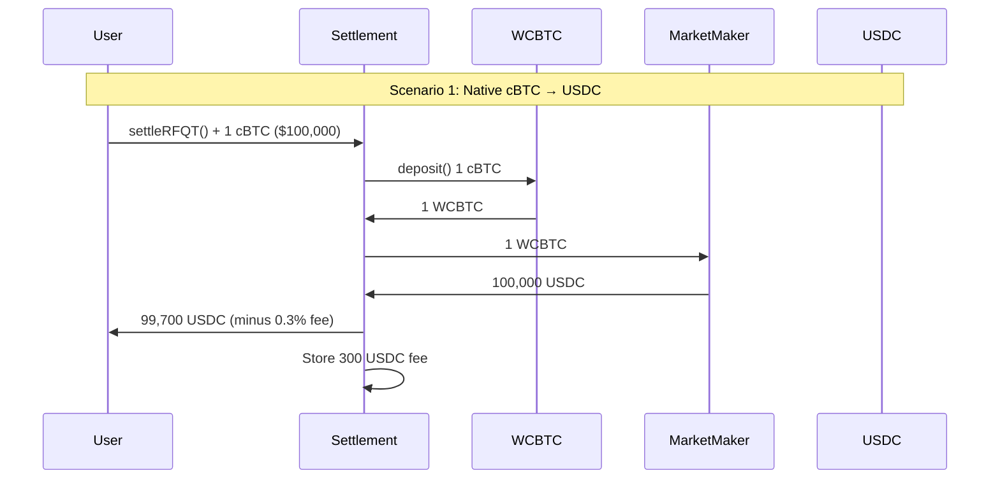
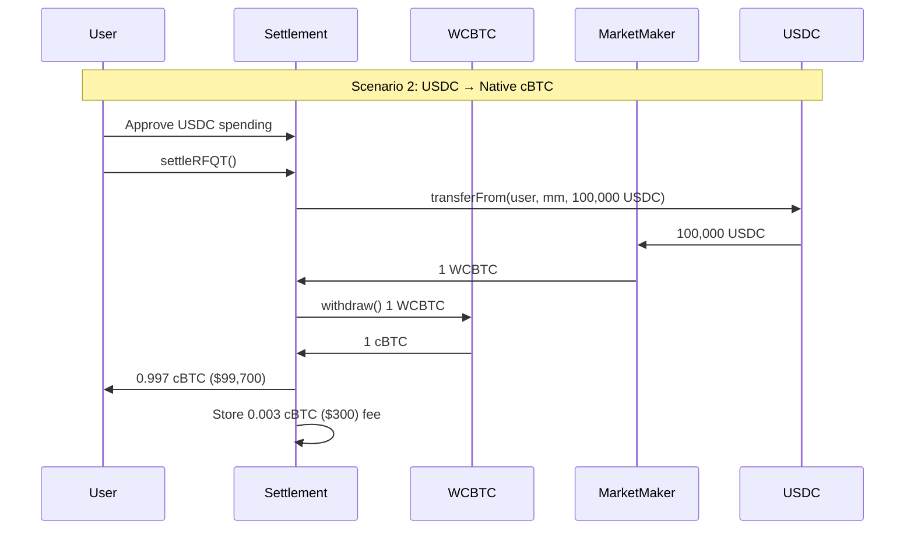
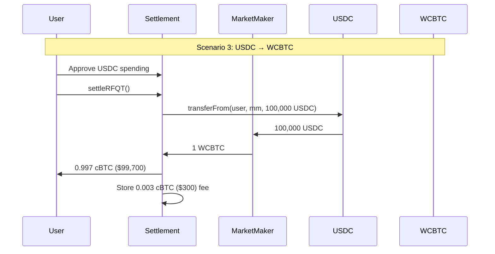

RFQ-T (Request for Quote - Trader) is Crest's **user-initiated settlement mechanism** where traders directly execute trades by sending transactions to the Settlement contract. This mode supports both native cBTC and ERC20 input tokens.

## Key Characteristics

<CardGroup cols={2}>
  <Card title="User-executed" icon="user-gear">
    Users directly sign and send settlement transactions
  </Card>
  <Card title="Gas Payment" icon="gas-pump">
    Users pay their own gas fees, ensuring no dependency on third-party relayers
  </Card>
  <Card title="Native cBTC Support" icon="bitcoin">
    Unique support for native cBTC as input token via `msg.value`
  </Card>
  <Card title="Single Signature" icon="signature">
    Only requires market maker's signature, simplifying the execution flow
  </Card>
</CardGroup>

## How RFQ-T Works

### 1. Quote Request & Response



### 2. Settlement Function Call

```solidity
function settleRFQT(
    QuoteParams calldata params,
    bytes calldata marketMakerSignature
) external payable nonReentrant {
    require(params.user == msg.sender, "Sender must be the user");
    _validateRFQT(params, marketMakerSignature);
    _executeRFQT(params);
}
```

## Trade Execution Scenarios

### Scenario 1: Native cBTC → ERC20 Token

**Example: Selling 1 cBTC ($100,000) for USDC**



**Execution Flow:**
1. User sends 1 cBTC ($100,000) with transaction (`msg.value`)
2. Settlement contract wraps cBTC into WCBTC
3. WCBTC transferred to market maker
4. Market maker transfers 100,000 USDC to user (minus protocol fee)
5. User receives 99,700 USDC (after 0.3% fee)

### Scenario 2: ERC20 Token → Native cBTC

**Example: Buying 1 cBTC with USDC**



**Execution Flow:**
1. USDC (100,000) transferred from user to market maker
2. Market maker sends 1 WCBTC to Settlement contract
3. Settlement contract unwraps WCBTC to native cBTC
4. 0.997 cBTC sent to user (minus protocol fee)
5. User receives native cBTC worth $99,700 (after 0.3% fee)

### Scenario 3: ERC20 → ERC20 Token

**Example: USDC → WCBTC**



## Technical Implementation

### Validation Process

```solidity
function _validateRFQT(
    QuoteParams memory params,
    bytes calldata marketMakerSignature
) private {
    // Prevent replay attacks
    require(!executedQuotes[params.quoteId], "Quote already executed");

    // Check expiration
    require(block.timestamp <= params.expiry, "Quote expired");

    // Validate market maker signature
    bytes32 quoteHash = hashQuote(params);
    require(
        validateSignature(params.marketMaker, quoteHash, marketMakerSignature),
        "Invalid market maker signature"
    );

    // Mark as executed
    executedQuotes[params.quoteId] = true;
}
```

### Execution Logic

```solidity
function _executeRFQT(QuoteParams memory params) private {
    (uint256 feeAmount, uint256 userReceiveAmount) = _calculateFee(params.amountOut);

    // Handle input token
    if (params.tokenIn == NATIVE_TOKEN) {
        require(msg.value == params.amountIn, "Incorrect cBTC amount");
        wcbtc.deposit{value: params.amountIn}();
        IERC20(address(wcbtc)).safeTransfer(params.marketMaker, params.amountIn);
    } else {
        IERC20(params.tokenIn).safeTransferFrom(
            params.user,
            params.marketMaker,
            params.amountIn
        );
    }

    // Handle output token
    if (params.tokenOut == NATIVE_TOKEN) {
        IERC20(address(wcbtc)).safeTransferFrom(
            params.marketMaker,
            address(this),
            params.amountOut
        );
        wcbtc.withdraw(params.amountOut);
        (bool success, ) = payable(params.user).call{value: userReceiveAmount}("");
        require(success, "cBTC transfer to user failed");

        if (feeAmount > 0) {
            collectedFees[NATIVE_TOKEN] += feeAmount;
        }
    } else {
        IERC20(params.tokenOut).safeTransferFrom(
            params.marketMaker,
            params.user,
            userReceiveAmount
        );

        if (feeAmount > 0) {
            IERC20(params.tokenOut).safeTransferFrom(
                params.marketMaker,
                address(this),
                feeAmount
            );
            collectedFees[params.tokenOut] += feeAmount;
        }
    }

    emit RFQSettled(/* ... */, true); // isRFQT = true
}
```

## User Experience Considerations

### Pre-Execution Checks

Before executing RFQ-T trades, we verify:

<AccordionGroup>
  <Accordion title="1. Balance Check">
    **For Native cBTC:**
    - Verify wallet has sufficient cBTC balance for trade amount
    - Add extra buffer for gas fees (approximately 0.0001 cBTC)
    - Example: For 1 cBTC trade ($100,000), ensure balance > 1.0001 cBTC

    **For ERC20 Tokens:**
    - Check token balance matches or exceeds trade amount
    - Example: For 100,000 USDC trade, verify USDC balance ≥ 100,000
  </Accordion>

  <Accordion title="2. Token Approval">
    **When trading ERC20 tokens:**
    - Check if Settlement contract has sufficient allowance
    - Current allowance should be ≥ trade amount
    - If insufficient:
      1. Call approve() on token contract
      2. Set allowance for Settlement contract address
      3. Wait for approval transaction to confirm

    **Note:** Not required for native cBTC trades
  </Accordion>

  <Accordion title="3. Quote Validation">
    **Expiration:**
    - Check current timestamp vs quote expiry
    - Quotes typically valid for 3-4 seconds
    - Request new quote if expired
  </Accordion>

  <Accordion title="4. Gas Estimation">
    **Ensure sufficient cBTC for gas:**
    - Check cBTC balance covers gas cost
    - Consider current gas prices on Citrea
    - Add 20% buffer for price fluctuations
  </Accordion>
</AccordionGroup>

### Error Handling

Common errors and their resolutions:

<AccordionGroup>
  <Accordion title="Insufficient Balance">
    **Error**: "Insufficient cBTC balance for trade + gas"

    **Resolution**:
    - Check total cBTC needed (trade amount + gas fees)
    - Ensure wallet has sufficient native cBTC
    - Consider reducing trade size
  </Accordion>

  <Accordion title="Quote Expired">
    **Error**: "Quote expired"

    **Resolution**:
    - Request a new quote from the RFQ system
    - Execute trades promptly after receiving quotes
    - Consider implementing quote refresh functionality
  </Accordion>

  <Accordion title="Insufficient Allowance">
    **Error**: "ERC20: insufficient allowance"

    **Resolution**:
    - Approve the Settlement contract to spend tokens
    - Use `approve()` or `increaseAllowance()`
    - Consider unlimited approval for frequent trading
  </Accordion>
</AccordionGroup>
