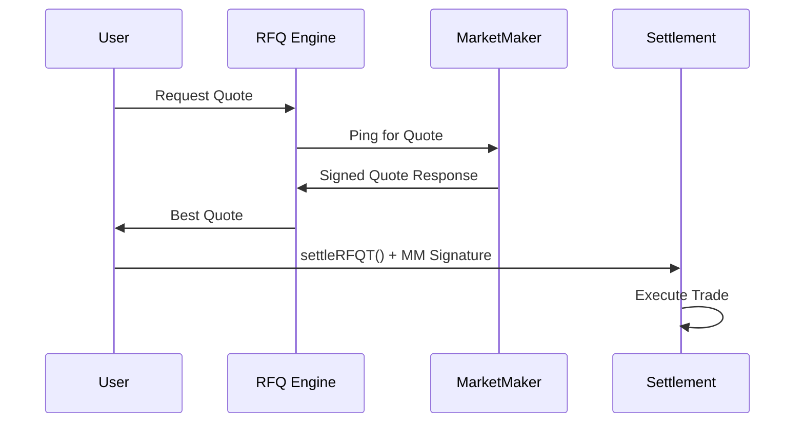

# RFQ-T: Trader-Initiated Settlement

RFQ-T (Request for Quote - Trader) is Crest's **user-initiated settlement mechanism** where traders directly execute trades by sending transactions to the Settlement contract. This mode provides maximum control to users while supporting both native cBTC and ERC20 tokens.

## Key Characteristics

<CardGroup cols={2}>
  <Card title="User Control" icon="user-gear">
    Users directly sign and send settlement transactions, maintaining full control over execution timing
  </Card>
  <Card title="Gas Payment" icon="gas-pump">
    Users pay their own gas fees, ensuring no dependency on third-party relayers
  </Card>
  <Card title="Native cBTC Support" icon="bitcoin">
    Unique support for native cBTC as input token via `msg.value`
  </Card>
  <Card title="Single Signature" icon="signature">
    Only requires market maker's signature, simplifying the execution flow
  </Card>
</CardGroup>

## How RFQ-T Works

### 1. Quote Request & Response



### 2. Settlement Function Call

```solidity
function settleRFQT(
    QuoteParams calldata params,
    bytes calldata marketMakerSignature
) external payable nonReentrant {
    require(params.user == msg.sender, "Sender must be the user");
    _validateRFQT(params, marketMakerSignature);
    _executeRFQT(params);
}
```

## Trade Execution Scenarios

### Scenario 1: Native cBTC → ERC20 Token

**Example: Selling 1 cBTC for USDC**

```typescript
// User has 1 cBTC, wants USDC
const quoteRequest = {
  tokenIn: NATIVE_TOKEN,     // Native cBTC
  tokenOut: USDC_ADDRESS,    // USDC token
  amountIn: "1000000000000000000", // 1 cBTC (18 decimals)
  user: userAddress
};

// Get quote from RFQ system
const quote = await rfqEngine.requestQuote(quoteRequest);
// Quote response: { amountOut: "1950000000", signature: "0x...", ... }

// Execute trade
const tx = await settlementContract.settleRFQT(
  {
    user: userAddress,
    marketMaker: quote.marketMaker,
    tokenIn: NATIVE_TOKEN,
    tokenOut: USDC_ADDRESS,
    amountIn: "1000000000000000000",
    amountOut: quote.amountOut,
    expiry: quote.expiry,
    quoteId: quote.quoteId
  },
  quote.signature,
  {
    value: "1000000000000000000", // Send 1 cBTC with transaction
    gasLimit: 200000
  }
);
```

**Execution Flow:**
1. User sends 1 cBTC with transaction (`msg.value`)
2. Settlement contract wraps cBTC into WCBTC
3. WCBTC transferred to market maker
4. Market maker transfers USDC to user (minus protocol fee)
5. Trade completed atomically

### Scenario 2: ERC20 Token → Native cBTC

**Example: Buying 1 cBTC with USDC**

```typescript
// User has USDC, wants native cBTC
const quoteRequest = {
  tokenIn: USDC_ADDRESS,     // USDC token
  tokenOut: NATIVE_TOKEN,    // Native cBTC
  amountIn: "2000000000",    // 2000 USDC (6 decimals)
  user: userAddress
};

// First: Approve USDC spending
await usdcContract.approve(SETTLEMENT_ADDRESS, "2000000000");

// Get quote
const quote = await rfqEngine.requestQuote(quoteRequest);

// Execute trade (no msg.value needed for ERC20 input)
const tx = await settlementContract.settleRFQT(
  {
    user: userAddress,
    marketMaker: quote.marketMaker,
    tokenIn: USDC_ADDRESS,
    tokenOut: NATIVE_TOKEN,
    amountIn: "2000000000",
    amountOut: quote.amountOut, // e.g., "1000000000000000000" (1 cBTC)
    expiry: quote.expiry,
    quoteId: quote.quoteId
  },
  quote.signature,
  {
    gasLimit: 200000
    // No value needed - using ERC20 input
  }
);
```

**Execution Flow:**
1. USDC transferred from user to market maker
2. Market maker sends WCBTC to Settlement contract
3. Settlement contract unwraps WCBTC to native cBTC
4. Native cBTC sent to user (minus protocol fee)
5. User receives native cBTC directly

### Scenario 3: ERC20 → ERC20 Token

**Example: USDC → WETH**

```typescript
// Standard ERC20 to ERC20 trade
const quoteRequest = {
  tokenIn: USDC_ADDRESS,
  tokenOut: WETH_ADDRESS,
  amountIn: "1000000000", // 1000 USDC
  user: userAddress
};

// Approve input token
await usdcContract.approve(SETTLEMENT_ADDRESS, "1000000000");

// Get and execute quote
const quote = await rfqEngine.requestQuote(quoteRequest);
const tx = await settlementContract.settleRFQT(quote.params, quote.signature);
```

## Technical Implementation

### Validation Process

```solidity
function _validateRFQT(
    QuoteParams memory params,
    bytes calldata marketMakerSignature
) private {
    // Prevent replay attacks
    require(!executedQuotes[params.quoteId], "Quote already executed");

    // Check expiration
    require(block.timestamp <= params.expiry, "Quote expired");

    // Validate market maker signature
    bytes32 quoteHash = hashQuote(params);
    require(
        validateSignature(params.marketMaker, quoteHash, marketMakerSignature),
        "Invalid market maker signature"
    );

    // Mark as executed
    executedQuotes[params.quoteId] = true;
}
```

### Execution Logic

```solidity
function _executeRFQT(QuoteParams memory params) private {
    (uint256 feeAmount, uint256 userReceiveAmount) = _calculateFee(params.amountOut);

    // Handle input token
    if (params.tokenIn == NATIVE_TOKEN) {
        require(msg.value == params.amountIn, "Incorrect cBTC amount");
        wcbtc.deposit{value: params.amountIn}();
        IERC20(address(wcbtc)).safeTransfer(params.marketMaker, params.amountIn);
    } else {
        IERC20(params.tokenIn).safeTransferFrom(
            params.user,
            params.marketMaker,
            params.amountIn
        );
    }

    // Handle output token
    if (params.tokenOut == NATIVE_TOKEN) {
        IERC20(address(wcbtc)).safeTransferFrom(
            params.marketMaker,
            address(this),
            params.amountOut
        );
        wcbtc.withdraw(params.amountOut);
        (bool success, ) = payable(params.user).call{value: userReceiveAmount}("");
        require(success, "cBTC transfer to user failed");

        if (feeAmount > 0) {
            collectedFees[NATIVE_TOKEN] += feeAmount;
        }
    } else {
        IERC20(params.tokenOut).safeTransferFrom(
            params.marketMaker,
            params.user,
            userReceiveAmount
        );

        if (feeAmount > 0) {
            IERC20(params.tokenOut).safeTransferFrom(
                params.marketMaker,
                address(this),
                feeAmount
            );
            collectedFees[params.tokenOut] += feeAmount;
        }
    }

    emit RFQSettled(/* ... */, true); // isRFQT = true
}
```

## User Experience Considerations

### Pre-Execution Checks

Before executing RFQ-T trades, users should verify:

<Tabs>
  <Tab title="Balance Verification">
    ```typescript
    // Check sufficient balance
    if (params.tokenIn === NATIVE_TOKEN) {
      const balance = await provider.getBalance(userAddress);
      const required = BigNumber.from(params.amountIn).add(estimatedGas);
      if (balance.lt(required)) {
        throw new Error("Insufficient cBTC balance for trade + gas");
      }
    } else {
      const balance = await tokenContract.balanceOf(userAddress);
      if (balance.lt(params.amountIn)) {
        throw new Error("Insufficient token balance");
      }
    }
    ```
  </Tab>

  <Tab title="Allowance Check">
    ```typescript
    // Check ERC20 allowance (not needed for native cBTC)
    if (params.tokenIn !== NATIVE_TOKEN) {
      const allowance = await tokenContract.allowance(userAddress, SETTLEMENT_ADDRESS);
      if (allowance.lt(params.amountIn)) {
        // Request approval
        const approveTx = await tokenContract.approve(
          SETTLEMENT_ADDRESS,
          ethers.constants.MaxUint256
        );
        await approveTx.wait();
      }
    }
    ```
  </Tab>

  <Tab title="Quote Validation">
    ```typescript
    // Verify quote hasn't expired
    if (Date.now() / 1000 > quote.expiry) {
      throw new Error("Quote has expired, request new quote");
    }

    // Verify minimum receive amount
    const minReceive = calculateMinReceive(quote.amountOut, slippageTolerance);
    if (quote.amountOut < minReceive) {
      throw new Error("Quote below minimum acceptable amount");
    }
    ```
  </Tab>
</Tabs>

### Error Handling

Common errors and their resolutions:

<AccordionGroup>
  <Accordion title="Insufficient Balance">
    **Error**: "Insufficient cBTC balance for trade + gas"

    **Resolution**:
    - Check total cBTC needed (trade amount + gas fees)
    - Ensure wallet has sufficient native cBTC
    - Consider reducing trade size
  </Accordion>

  <Accordion title="Quote Expired">
    **Error**: "Quote expired"

    **Resolution**:
    - Request a new quote from the RFQ system
    - Execute trades promptly after receiving quotes
    - Consider implementing quote refresh functionality
  </Accordion>

  <Accordion title="Insufficient Allowance">
    **Error**: "ERC20: insufficient allowance"

    **Resolution**:
    - Approve the Settlement contract to spend tokens
    - Use `approve()` or `increaseAllowance()`
    - Consider unlimited approval for frequent trading
  </Accordion>

  <Accordion title="Invalid Signature">
    **Error**: "Invalid market maker signature"

    **Resolution**:
    - Verify quote data hasn't been modified
    - Ensure using correct market maker signature
    - Request fresh quote if signature validation fails
  </Accordion>
</AccordionGroup>

## Gas Optimization

### Estimated Gas Costs

| Trade Type | Estimated Gas | Notes |
|------------|---------------|-------|
| Native cBTC → ERC20 | ~180,000 gas | Includes WCBTC wrapping |
| ERC20 → Native cBTC | ~160,000 gas | Includes WCBTC unwrapping |
| ERC20 → ERC20 | ~140,000 gas | Standard ERC20 transfers only |

### Gas Optimization Tips

```typescript
// 1. Use appropriate gas limit
const gasLimit = calculateGasLimit(tradeType);

// 2. Consider gas price optimization
const gasPrice = await provider.getGasPrice();
const optimizedGasPrice = gasPrice.mul(110).div(100); // 10% premium

// 3. Batch operations when possible
const tx = await settlementContract.settleRFQT(params, signature, {
  gasLimit,
  gasPrice: optimizedGasPrice
});
```

## Frontend Integration

### React Component Example

```typescript
const RFQTTrade: React.FC = () => {
  const [quote, setQuote] = useState<Quote | null>(null);
  const [loading, setLoading] = useState(false);

  const executeRFQT = async () => {
    if (!quote) return;

    setLoading(true);
    try {
      // Pre-execution checks
      await validateTradeRequirements(quote);

      // Execute settlement
      const tx = await settlementContract.settleRFQT(
        quote.params,
        quote.signature,
        {
          value: quote.params.tokenIn === NATIVE_TOKEN
            ? quote.params.amountIn
            : 0,
          gasLimit: estimateGas(quote.params)
        }
      );

      // Wait for confirmation
      const receipt = await tx.wait();

      // Update UI
      onTradeSuccess(receipt);

    } catch (error) {
      handleTradeError(error);
    } finally {
      setLoading(false);
    }
  };

  return (
    <div>
      {quote && (
        <div>
          <div>Receive: {formatAmount(quote.amountOut)} {quote.tokenOut}</div>
          <div>Fee: {calculateFee(quote.amountOut)}</div>
          <button onClick={executeRFQT} disabled={loading}>
            {loading ? "Executing..." : "Execute Trade"}
          </button>
        </div>
      )}
    </div>
  );
};
```

## Security Best Practices

### For Users

1. **Verify Quotes**: Always validate quote parameters before execution
2. **Check Balances**: Ensure sufficient funds including gas costs
3. **Time Sensitivity**: Execute quotes promptly before expiration
4. **Slippage Protection**: Implement minimum receive amount checks

### For Integrators

1. **Input Validation**: Sanitize all user inputs before contract calls
2. **Error Handling**: Implement comprehensive error handling
3. **Gas Estimation**: Provide accurate gas estimates to users
4. **Quote Verification**: Validate quotes client-side before execution

## Advantages vs RFQ-M

<CardGroup cols={2}>
  <Card title="RFQ-T Advantages" icon="thumbs-up">
    - Native cBTC support
    - Direct user control
    - No relayer dependency
    - Simpler signature requirements
  </Card>
  <Card title="RFQ-M Advantages" icon="thumbs-up">
    - Gas abstraction for users
    - Better for institutional flows
    - Batch execution possible
    - Meta-transaction support
  </Card>
</CardGroup>

## Next Steps

Now that you understand RFQ-T:
- [RFQ-M Trading](/trading/rfqm) - Learn about relayer-initiated settlement
- [Fee Structure](/trading/fees) - Understand protocol fees and optimization
- [Frontend Integration](/integration/frontend) - Build RFQ-T trading interfaces